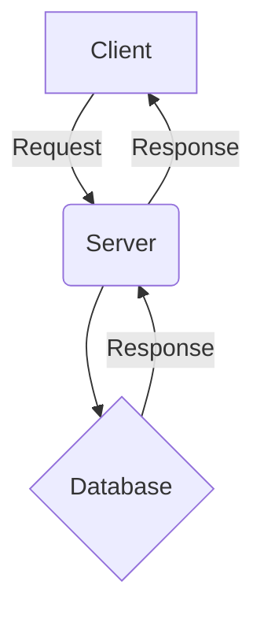

# 포스트 제목

## 🚀 개요
이 포스트에서는 [프로젝트/기능 이름]의 구현 과정과 핵심 개념을 다룹니다.

## 💡 구현 배경 및 동기
- 왜 이 기능을 구현하게 되었는가?
- 해결하고자 했던 문제점은 무엇인가?

## 🛠 핵심 코드 분석
```javascript
// 핵심 코드 스니펫
function example() {
  console.log("핵심 로직 설명");
}
```
- **코드 설명:** 위 코드는 [특정 역할]을 수행하며, 특히 [중요한 부분]에 유의해야 합니다.

## 📐 아키텍처 (필요 시)


## 📝 배운 점 및 결론
- 프로젝트를 통해 새롭게 알게 된 사실
- 구현 과정에서 마주한 어려움과 해결 방법
- 향후 개선 계획

---

*작성자: [사용자 이름]*
*작성일: [YYYY-MM-DD]*
