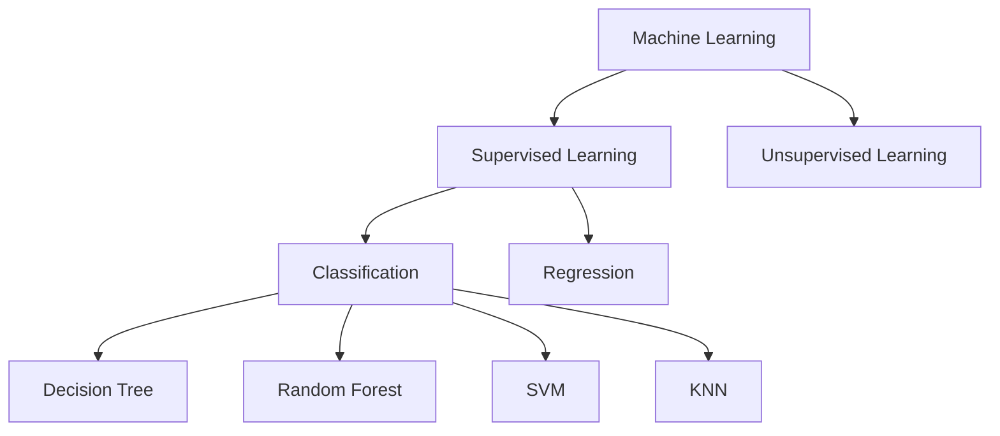

# 가장 많이 쓰이는 머신러닝 알고리즘 TOP 10 총정리

## 🚀 개요
딥러닝이 화두인 시대이지만, 모든 문제에 딥러닝이 정답은 아닙니다. 데이터가 충분하지 않거나 빠른 결과가 필요할 때는 전통적인 머신러닝 알고리즘이 더 효율적일 수 있습니다. 이 포스트에서는 가장 널리 쓰이는 10가지 머신러닝 알고리즘을 살펴보고, 동일한 데이터셋(피마 인디언 당뇨병 데이터)에서의 성능을 비교해 봅니다.

## 💡 주요 알고리즘 요약

### 1. 결정 트리 (Decision Tree)
- **특징:** 질문을 던져 데이터를 분류하는 나무 구조. 이해하기 쉽지만 과적합(Overfitting) 위험이 있습니다.
- **성능:** 약 66.15% (정확도)

### 2. 랜덤 포레스트 (Random Forest)
- **특징:** 여러 개의 결정 트리를 만들어 그 결과를 종합(앙상블)하는 방식. 결정 트리의 단점을 보완하여 안정적인 성능을 냅니다.
- **성능:** 약 74.83%

### 3. 서포트 벡터 머신 (SVM)
- **특징:** 데이터를 나누는 최적의 경계선(결정 경계)을 찾는 알고리즘. '커널 트릭'을 통해 복잡한 비선형 데이터도 잘 처리합니다.
- **성능 (Linear 커널):** 약 75.51% / **(RBF 커널):** 약 75.86%

### 4. K-최근접 이웃 (KNN)
- **특징:** 새로운 데이터를 가장 가까운 K개의 이웃 데이터와 비교하여 분류하는 방식.
- **성능:** 약 72.91%

## 🛠 앙상블 기법 (Ensemble)
개별 알고리즘보다 더 강력한 성능을 내기 위해 여러 모델을 결합하는 방법입니다.
- **보팅 (Voting):** 투표를 통해 최종 결과 결정. (예: AdaBoost + RandomForest + SVM 조합)
- **배깅 (Bagging):** 샘플을 중복 허용하여 여러 번 뽑아 학습. (예: Bagging + SVM)
- **부스팅 (Boosting):** 이전 모델의 오차를 보완하며 학습. (예: AdaBoost)

## 📊 알고리즘별 성능 비교 결과
실험 결과, 피마 인디언 당뇨병 데이터셋에서는 **AdaBoost**와 **SVM(RBF)**, 그리고 **Bagging** 기법이 75% 이상의 높은 정확도를 보였습니다.

## 📝 배운 점 및 결론
- **데이터 스케일링:** `StandardScaler`를 통한 데이터 전처리가 알고리즘 성능(특히 SVM이나 KNN)에 큰 영향을 미친다는 것을 확인했습니다.
- **적재적소의 원칙:** 데이터의 양과 비즈니스 요구사항에 따라 딥러닝이 아닌 전통적 머신러닝이 최선의 선택이 될 수 있습니다.
- **앙상블의 힘:** 단일 모델보다 여러 모델을 결합했을 때 더 일반화된 성능을 얻을 수 있음을 수치로 확인했습니다.

---

*작성자: kim-hyunjin*
*작성일: 2026-04-21*
