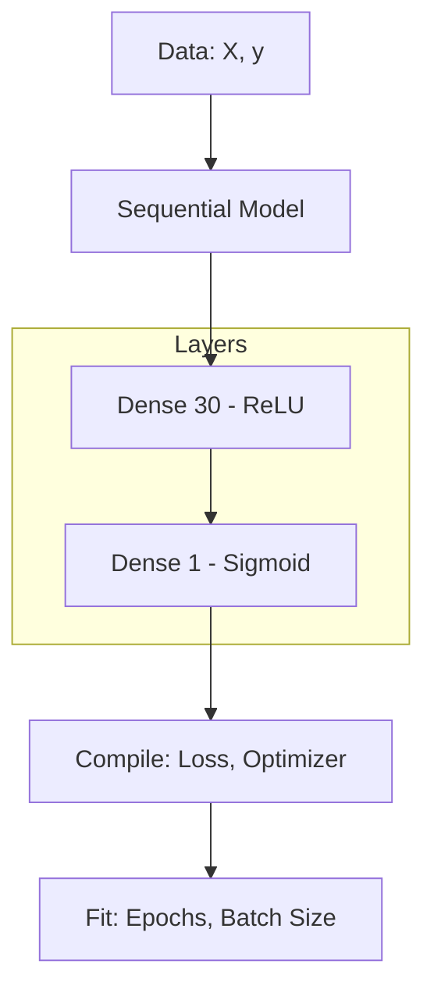

# 딥러닝 모델 설계와 데이터 전처리 파이프라인

## 🚀 개요
딥러닝 모델을 만드는 과정은 집을 짓는 과정과 비슷합니다. 튼튼한 기초(데이터)를 다지고, 설계도(모델 구조)를 그리며, 적절한 재료(컴파일 옵션)를 선택하여 집을 완성(학습)합니다. 이번 포스트에서는 케라스(Keras) 라이브러리를 활용한 표준적인 딥러닝 모델 설계 프로세스를 정리합니다.

## 💡 딥러닝 모델 설계의 4단계

### 1단계: 환경 및 데이터 준비
먼저 텐서플로의 케라스 API를 불러오고 데이터를 로드합니다. 데이터는 학습에 적합하도록 속성(Feature, X)과 클래스(Label, y)로 분리해야 합니다.

```python
from tensorflow.keras.models import Sequential
from tensorflow.keras.layers import Dense
import numpy as np

# 데이터 로드 및 분리
Data_set = np.loadtxt("surgery_data.csv", delimiter=",")
X = Data_set[:, 0:16] # 환자의 진찰 기록
y = Data_set[:, 16]   # 수술 결과 (생존/사망)
```

### 2단계: 모델 구조 결정
`Sequential()` 함수를 통해 계층을 차례로 쌓습니다. `Dense` 층을 통해 뉴런의 개수와 활성화 함수를 지정합니다.

```python
model = Sequential()
model.add(Dense(30, input_dim=16, activation='relu')) # 입력층 + 은닉층
model.add(Dense(1, activation='sigmoid'))              # 출력층
```
- **ReLU:** 은닉층에서 가장 많이 쓰이며 학습 속도가 빠릅니다.
- **Sigmoid:** 출력층에서 결과를 0과 1 사이의 확률로 표현할 때 사용합니다.

### 3단계: 컴파일 (Compile)
결정된 모델 구조를 컴퓨터가 이해할 수 있도록 컴파일합니다. 이때 오차 함수, 최적화 방법, 평가 지표를 설정합니다.

```python
model.compile(loss='binary_crossentropy', optimizer='adam', metrics=['accuracy'])
```
- **binary_crossentropy:** 이진 분류(맞다/아니다) 문제에 사용합니다.
- **adam:** 현재 가장 널리 쓰이는 효율적인 최적화 알고리즘입니다.

### 4단계: 모델 실행 (Fit)
학습 데이터를 모델에 넣고 가중치를 업데이트합니다.

```python
model.fit(X, y, epochs=100, batch_size=10)
```
- **epochs:** 전체 데이터를 몇 번 반복해서 학습할지 결정합니다.
- **batch_size:** 한 번에 학습할 데이터의 묶음 크기입니다.

## 📐 모델 설계 아키텍처


## 📝 배운 점 및 결론
- **구조의 간결함:** 케라스를 사용하면 복잡한 수식 없이도 몇 줄의 코드로 딥러닝 모델의 뼈대를 만들 수 있습니다.
- **하이퍼파라미터의 중요성:** 은닉층의 뉴런 개수, 활성화 함수 선택, 에포크 횟수 등이 모델의 정확도에 직접적인 영향을 미칩니다.
- **데이터가 우선:** 아무리 훌륭한 모델 설계도 양질의 데이터와 적절한 전처리(X, y 분리 및 스케일링)가 선행되지 않으면 의미가 없음을 다시 확인했습니다.

---

*작성자: kim-hyunjin*
*작성일: 2026-04-21*
