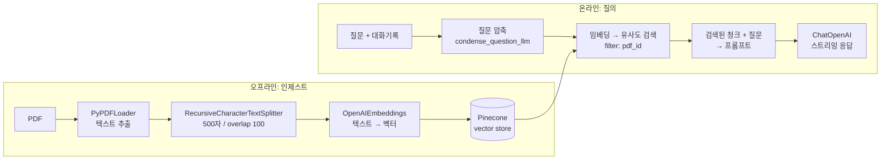

# pdf-app으로 배우는 RAG 만드는 법

이 문서는 이 디렉터리(`pdf-app`)의 실제 코드를 따라가며 **RAG(Retrieval-Augmented Generation)** 를
어떻게 설계하고 구현하는지 설명합니다. 개념 → 이 앱의 아키텍처 → 파일별 코드 해설 →
"내가 처음부터 만든다면" 최소 구현 → 운영/개선 포인트 순서입니다.

---

## 1. RAG가 필요한 이유

LLM은 두 가지 한계가 있습니다.

1. **모르는 데이터**: 학습 시점 이후의 정보나, 내 회사·내 PDF 같은 비공개 문서는 모릅니다.
2. **컨텍스트 한계 & 비용**: PDF 300페이지를 통째로 프롬프트에 넣는 것은 토큰 한계와 비용,
   그리고 정확도(lost in the middle) 면에서 모두 불리합니다.

RAG는 "**질문과 관련 있는 조각만 골라서** 프롬프트에 넣어준다"는 아주 단순한 전략으로 이 둘을 해결합니다.

> RAG = 검색(Retrieval) + 프롬프트 주입(Augmentation) + 생성(Generation)

핵심은 **검색 품질이 답변 품질의 상한선**이라는 점입니다. LLM을 바꾸는 것보다 청킹/검색을
개선하는 쪽이 효과가 큰 경우가 많습니다.

---

## 2. 큰 그림: 두 개의 파이프라인

RAG 앱은 항상 **오프라인(인제스트)** 과 **온라인(질의)** 두 파이프라인으로 나뉩니다.
이 앱도 정확히 그렇게 나뉘어 있습니다.

### 2-1. 인제스트 파이프라인 (PDF 업로드 시 1회)

```
PDF 업로드
  → app/web/views/pdf_views.py   : 파일 저장 + DB 레코드 생성
  → process_document.delay()      : Celery 큐로 비동기 위임
  → app/web/tasks/embeddings.py   : 워커가 PDF 다운로드
  → app/chat/create_embeddings.py : Load → Split → Embed → Store
  → Pinecone 인덱스에 벡터 저장
```

### 2-2. 질의 파이프라인 (메시지를 보낼 때마다)

```
사용자 질문
  → app/web/views/conversation_views.py : ChatArgs 구성
  → app/chat/chat.py                    : retriever / llm / memory 조합해 체인 생성
  → StreamingConversationalRetrievalChain
       ├ 1) 대화기록 + 질문 → 독립형 질문으로 압축 (condense_question_llm)
       ├ 2) 압축된 질문을 임베딩 → Pinecone에서 top-k 청크 검색 (pdf_id 필터)
       └ 3) 청크 + 질문 → LLM → 토큰 스트리밍 응답
  → SSE로 클라이언트에 전달, 메시지는 DB에 저장
```



---

## 3. 인제스트: 코드로 보는 4단계

### 단계 0. 업로드는 즉시 응답하고, 임베딩은 워커로 넘긴다

`app/web/views/pdf_views.py`:

```python
pdf = Pdf.create(id=file_id, name=file_name, user_id=g.user.id)

# 요청 스레드에서 처리하지 않고 큐로 위임한다
process_document.delay(pdf.id)
```

**왜 중요한가**: 300페이지 PDF의 임베딩 생성은 수십 초~수 분이 걸립니다. HTTP 요청 안에서
동기로 처리하면 타임아웃이 나고 사용자 경험이 무너집니다. RAG 앱에서 인제스트를
**비동기 작업 큐(Celery + Redis)** 로 빼는 것은 사실상 필수 패턴입니다.

`app/web/tasks/embeddings.py`:

```python
@shared_task()
def process_document(pdf_id: int):
    pdf = Pdf.find_by(id=pdf_id)
    with download(pdf.id) as pdf_path:   # 임시 디렉터리에 받고 끝나면 정리
        create_embeddings_for_pdf(pdf.id, pdf_path)
```

### 단계 1~4. Load → Split → Embed → Store

`app/chat/create_embeddings.py` 가 RAG 인제스트의 교과서적인 4단계 그 자체입니다.

```python
text_splitter = RecursiveCharacterTextSplitter(chunk_size=500, chunk_overlap=100)

loader = PyPDFLoader(pdf_path)
docs = loader.load_and_split(text_splitter)   # 1) Load + 2) Split

for doc in docs:
    doc.metadata = {
        "page": doc.metadata["page"],
        "text": doc.page_content,
        "pdf_id": pdf_id,        # ← 나중에 검색 필터로 쓰는 핵심 필드
    }

vector_store.add_documents(docs)              # 3) Embed + 4) Store
```

#### 청킹(Split)이 RAG의 첫 번째 승부처

- `chunk_size=500`: 한 청크에 담기는 글자 수. 너무 크면 관련 없는 내용이 섞여 노이즈가 되고,
  너무 작으면 문맥이 잘려 답을 만들 수 없습니다.
- `chunk_overlap=100`: 청크 경계에서 문장이 잘리는 문제를 완화합니다. 앞 청크의 끝 100자를
  다음 청크가 다시 포함합니다.
- `Recursive...`: `\n\n` → `\n` → ` ` → `""` 순으로 **의미 단위가 큰 구분자부터** 시도하며 자릅니다.
  그래서 단순 `CharacterTextSplitter`보다 문단 구조를 잘 보존합니다.

> 튜닝 감각: 일반 문서 500~1000자 / overlap 10~20%가 출발점입니다. 표·코드가 많은 문서라면
> 청크를 키우거나 구조 인식 로더(예: `UnstructuredPDFLoader`)를 고려하세요.

#### 메타데이터가 두 번째 승부처

`pdf_id`를 메타데이터로 심어두었기 때문에, 나중에 **"지금 보고 있는 PDF 안에서만" 검색**할 수
있습니다. 이게 없으면 A 문서에 대해 물었는데 B 문서 내용으로 답하는 사고가 납니다.
`page`를 넣어둔 덕분에 출처(몇 페이지)를 표시하는 것도 가능합니다.

---

## 4. 저장소: 벡터 스토어와 리트리버

`app/chat/vector_stores/pinecone.py`:

```python
vector_store = Pinecone.from_existing_index(
    os.getenv("PINECONE_INDEX_NAME"), embeddings
)

def build_retriever(chat_args: ChatArgs, k):
    search_kwargs = {"filter": {"pdf_id": chat_args.pdf_id}, "k": k}
    return vector_store.as_retriever(search_kwargs=search_kwargs)
```

- **임베딩**: `OpenAIEmbeddings` (`app/chat/embeddings/openai.py`). 텍스트를 고차원 벡터로 바꿉니다.
  **인제스트와 질의에서 반드시 같은 임베딩 모델을 써야 합니다.** 모델을 바꾸면 인덱스를 다시 만들어야 합니다.
- **검색**: 질문도 같은 방식으로 벡터화한 뒤, 코사인 유사도가 높은 상위 `k`개를 가져옵니다.
- **필터**: `filter={"pdf_id": ...}`로 검색 범위를 현재 문서로 좁힙니다. 멀티테넌트 앱이라면
  `user_id` 필터도 같은 방식으로 반드시 넣어야 합니다(문서 유출 방지).
- **`k` 선택**: `app/chat/vector_stores/__init__.py`에서 k=1, 2를 각각 다른 리트리버로 등록해두고
  런타임에 비교합니다(→ 7장 실험 파트).

```python
retriever_map = {
    "pinecone_1": partial(build_retriever, k=1),
    "pinecone_2": partial(build_retriever, k=2),
    "pinecone_3": partial(build_retriever, k=2),
}
```

> 이렇게 같은 리트리버를 파라미터만 바꿔 여러 개 등록해두면 "k가 몇일 때 답변이 좋은가"를
> 실제 사용자 피드백으로 비교할 수 있습니다. 다만 **등록된 조합이 실제로 서로 달라야** 의미가
> 있습니다 — 예전에는 `pinecone_3`도 k=2로 되어 있어 `pinecone_2`와 구분되지 않았습니다.

---

## 5. 질의: 대화형 RAG 체인

`app/chat/chat.py` → `StreamingConversationalRetrievalChain`

```python
condense_question_llm = ChatOpenAI(streaming=False)

return StreamingConversationalRetrievalChain.from_llm(
    llm=llm,                                   # 최종 답변용(스트리밍)
    condense_question_llm=condense_question_llm,# 질문 압축용(비스트리밍)
    memory=memory,
    retriever=retriever,
    metadata=chat_args.metadata,
)
```

### 5-1. 왜 "질문 압축"이 필요한가

대화형 RAG의 함정입니다. 사용자가 이렇게 묻는다고 해봅시다.

```
User: ReAct 논문의 핵심 아이디어가 뭐야?
AI:   (설명)
User: 그거 한계는?          ← 이 문장만 임베딩하면 아무것도 못 찾는다
```

"그거 한계는?"은 벡터 검색에 쓸 수 없는 질문입니다. 그래서 체인은 먼저
**대화 기록 + 후속 질문 → 독립적으로 이해 가능한 질문(standalone question)** 으로 다시 씁니다.
("ReAct 논문 접근법의 한계는 무엇인가?") 그 다음에 그 문장으로 검색합니다.

`ConversationalRetrievalChain`은 그래서 LLM을 **두 번** 호출합니다.

### 5-2. 왜 압축용 LLM은 `streaming=False`인가

`app/chat/callbacks/stream.py`의 `StreamingHandler`는 체인 안의 **모든** LLM 호출에 붙습니다.
압축용 LLM도 스트리밍이면 그 토큰이 사용자에게 새어 나가고, 압축이 끝나는 순간
`on_llm_end`에서 큐에 `None`이 들어가 **스트림이 조기 종료**됩니다.

핸들러는 이 문제를 두 겹으로 막습니다.

```python
def on_chat_model_start(self, serialized, ...):
    if serialized["kwargs"]["streaming"]:      # 스트리밍 모델의 run_id만 기록
        self.streaming_run_ids.add(run_id)

def on_llm_end(self, response, run_id, **kwargs):
    if run_id in self.streaming_run_ids:      # 기록된 run만 종료 신호
        self.queue.put(None)
```

**교훈**: 콜백은 체인 전체에 전파된다. 어떤 LLM의 토큰인지 `run_id`로 구분하라.

### 5-3. 스트리밍 구현 (`chains/streamable.py`)

LangChain 체인 실행은 블로킹이므로, 별도 스레드에서 돌리고 큐로 토큰을 받아 제너레이터로 뱉습니다.

```python
def stream(self, input):
    queue = Queue()
    handler = StreamingHandler(queue)

    def task(app_context):
        app_context.push()          # Flask 컨텍스트를 새 스레드로 전달
        self(input, callbacks=[handler])

    Thread(target=task, args=[current_app.app_context()]).start()

    while True:
        token = queue.get()
        if token is None:
            break
        yield token
```

뷰에서는 `Response(stream_with_context(chat.stream(input)), mimetype="text/event-stream")`으로
SSE 응답을 내려줍니다(`conversation_views.py`).

### 5-4. 메모리: 대화 기록을 DB에 둔다

`app/chat/memories/histories/sql_history.py`는 `BaseChatMessageHistory`를 구현해
LangChain 메모리의 저장소를 **애플리케이션 DB**로 바꿉니다.

```python
class SqlMessageHistory(BaseChatMessageHistory, BaseModel):
    conversation_id: str

    @property
    def messages(self):
        return get_messages_by_conversation_id(self.conversation_id)

    def add_message(self, message):
        return add_message_to_conversation(...)
```

이렇게 하면 서버를 재시작해도, 여러 워커에 요청이 흩어져도 대화가 이어집니다.
메모리 전략은 두 가지를 등록해두고 비교합니다(`memories/__init__.py`).

| 전략 | 클래스 | 특징 |
|---|---|---|
| `sql_buffer_memory` | `ConversationBufferMemory` | 전체 기록 사용. 정확하지만 길어지면 토큰 폭증 |
| `sql_window_memory` | `ConversationBufferWindowMemory(k=2)` | 최근 2턴만 사용. 저렴·빠름, 오래된 맥락은 손실 |

> 주의: 이때 메시지는 반드시 **시간 오름차순(`created_on.asc()`)** 으로 돌려줘야 합니다.
> 최신순(desc)으로 주면 질문 압축 프롬프트에 대화가 거꾸로 들어가고,
> `ConversationBufferWindowMemory(k=2)`가 "최근 2턴"이 아니라 "가장 오래된 2턴"을 집습니다.
> 눈에 잘 안 띄면서 답변 품질을 조용히 망가뜨리는 종류의 버그입니다.

---

## 6. 처음부터 만든다면: 최소 RAG 20줄

위 구조를 걷어내고 뼈대만 남기면 RAG는 이렇게 짧습니다.
(같은 저장소의 `ai/langchain/intro-vector-db/rag-with-pdf.py`가 이 형태입니다.)

```python
from langchain_community.document_loaders import PyPDFLoader
from langchain_text_splitters import RecursiveCharacterTextSplitter
from langchain_openai import OpenAIEmbeddings, ChatOpenAI
from langchain_community.vectorstores import FAISS
from langchain.chains.retrieval import create_retrieval_chain
from langchain.chains.combine_documents import create_stuff_documents_chain
from langchain import hub

# 1) Load
docs = PyPDFLoader("react-paper.pdf").load()

# 2) Split
chunks = RecursiveCharacterTextSplitter(
    chunk_size=1000, chunk_overlap=100
).split_documents(docs)

# 3) Embed + 4) Store (로컬 개발은 FAISS면 충분하다)
embeddings = OpenAIEmbeddings()
store = FAISS.from_documents(chunks, embeddings)
store.save_local("faiss_index")

# 5) Retrieve + 6) Generate
retriever = store.as_retriever(search_kwargs={"k": 4})
combine = create_stuff_documents_chain(
    ChatOpenAI(model="gpt-4o-mini"),
    hub.pull("langchain-ai/retrieval-qa-chat"),
)
chain = create_retrieval_chain(retriever, combine)

print(chain.invoke({"input": "ReAct의 핵심을 3문장으로"})["answer"])
```

**개발 순서 추천**

1. FAISS + 스크립트로 "검색이 제대로 되는지"부터 확인 (`retriever.invoke(질문)` 출력만 눈으로 검수)
2. 검색이 납득되면 LLM 붙이기
3. 대화형이 필요해지면 질문 압축 + 메모리 추가
4. 서비스로 만들 때 → 비동기 인제스트(Celery), 관리형 벡터DB(Pinecone 등), 스트리밍, 메타데이터 필터

즉 **이 앱은 4단계까지 간 결과물**입니다. 처음부터 이 구조로 시작할 필요는 없습니다.

---

## 7. 이 앱이 특별히 잘 한 것: 실험과 평가

RAG는 "무엇이 더 나은 조합인지" 감으로 알 수 없습니다. 이 앱은 그걸 코드로 풀었습니다.

### 7-1. 컴포넌트를 맵으로 등록하고 런타임에 조합

```python
retriever_map = {"pinecone_1": ..., "pinecone_2": ..., "pinecone_3": ...}
llm_map       = {"gpt-4": ..., "gpt-3.5-turbo": ...}
memory_map    = {"sql_buffer_memory": ..., "sql_window_memory": ...}
```

`build_chat`은 대화마다 조합을 하나 뽑고, 그 선택을 대화 레코드에 저장합니다
(`set_conversation_components`). 같은 대화에서는 계속 같은 조합을 씁니다 — 그래야 평가가 오염되지 않습니다.

### 7-2. 사용자 피드백을 확률로 되먹임 (`app/chat/score.py`)

```python
def random_component_by_score(component_type, component_map):
    # 평균 점수에 비례한 가중 랜덤 선택 (최소 0.1로 바닥을 깔아 탐색 유지)
    ...
```

좋은 평가를 받은 컴포넌트가 더 자주 뽑히는 **multi-armed bandit**에 가까운 구조입니다.
`max(avg, 0.1)`이 탐색(exploration)을 보장합니다.

### 7-3. 트레이싱 (`chains/traceable.py` + Langfuse)

`TraceableChain`을 MRO 앞쪽에 섞어 모든 호출에 트레이스 핸들러를 자동으로 붙입니다.

```python
class StreamingConversationalRetrievalChain(
    TraceableChain, StreamableChain, ConversationalRetrievalChain
):
    pass
```

"어떤 청크가 검색됐고, 프롬프트가 어떻게 조립됐고, 토큰을 얼마나 썼는지"를 볼 수 없으면
RAG 디버깅은 불가능에 가깝습니다. **트레이싱은 선택이 아니라 필수**입니다.

> 이 되먹임 구조에서 실수하기 쉬운 두 가지가 있습니다.
>
> 1. **읽는 키와 쓰는 키가 달라지는 것.** 예전 `score.py`는 쓸 때 `llm_srore_values`(오타),
>    읽을 때 `llm_score_values`를 써서 점수가 전혀 반영되지 않았습니다. 지금은
>    `_values_key()` / `_counts_key()` 헬퍼로 키를 한 곳에서 만들어 이 실수를 구조적으로 막습니다.
> 2. **정수 연산으로 실수 점수를 누적하는 것.** `hincrby`는 정수만 다루므로 0.75 같은 점수가
>    0으로 절삭됩니다. 점수 합계는 `hincrbyfloat`, 평가 횟수는 `hincrby`로 나눠 써야 합니다.

---

## 8. 품질을 올리는 개선 포인트

검색이 부실하면 어떤 LLM도 못 살립니다. 효과 순으로:

1. **k를 늘려라**: k=1~2는 지나치게 작습니다. 4~8로 시작해 보세요.
2. **MMR 검색**: 유사한 청크만 중복해서 뽑히는 문제를 줄입니다.
   `as_retriever(search_type="mmr", search_kwargs={"k": 5, "fetch_k": 20})`
3. **하이브리드 검색**: 벡터 + BM25 키워드 검색을 앙상블. 고유명사·코드·숫자에 강해집니다.
4. **리랭킹**: 20개를 뽑아 Cross-Encoder/Cohere Rerank로 상위 4개만 LLM에 전달.
5. **출처 표시**: 메타데이터의 `page`를 답변과 함께 반환해 검증 가능하게 만듭니다.
   (`return_source_documents=True`)
6. **프롬프트 가드**: "제공된 문맥에 없으면 모른다고 답하라"를 명시해 환각을 줄입니다.
7. **부모-자식 청킹**: 작은 청크로 검색하고, LLM에는 그 청크가 속한 더 큰 문단을 넘깁니다
   (`ParentDocumentRetriever`).
8. **평가셋 구축**: 질문–정답 쌍 30~50개를 만들어 두면 위 변경들을 숫자로 비교할 수 있습니다.

### 흔한 함정

| 함정 | 증상 | 해결 |
|---|---|---|
| 인제스트/질의 임베딩 모델 불일치 | 검색 결과가 무작위 | 모델 고정, 바꾸면 재인덱싱 |
| 메타데이터 필터 누락 | 다른 문서 내용으로 답변 | `pdf_id`·`user_id` 필터 필수 |
| 중복 인제스트 | 같은 청크가 여러 번 검색됨 | 청크 ID를 결정적으로(해시) 만들어 upsert |
| 스캔 PDF | 텍스트가 비어 있음 | OCR 전처리 필요 |
| 인제스트 실패 무시 | "왜 답을 못 하지?" | 작업 상태를 DB에 기록하고 UI에 노출 |
| 동기 인제스트 | 업로드 타임아웃 | 큐로 위임 (이 앱의 방식) |

---

## 9. 버전에 대한 참고

이 앱은 `langchain==0.0.352` 기준이라 임포트 경로가 예전 방식입니다
(`from langchain.chat_models import ChatOpenAI`, `from langchain.vectorstores import Pinecone`).
지금 새로 만든다면 패키지가 분리된 최신 구조를 쓰세요.

```python
from langchain_openai import ChatOpenAI, OpenAIEmbeddings
from langchain_pinecone import PineconeVectorStore
from langchain_text_splitters import RecursiveCharacterTextSplitter
from langchain_core.runnables import RunnablePassthrough
```

또한 `ConversationalRetrievalChain`은 레거시입니다. 최신 권장 조합은
`create_history_aware_retriever`(= 질문 압축) + `create_retrieval_chain`이며,
스트리밍도 `chain.stream()` / `astream_events()`로 기본 제공되어
이 앱의 `StreamableChain`·`StreamingHandler` 같은 커스텀 코드가 대부분 불필요해집니다.
다만 **개념(압축 → 검색 → 생성, run_id로 스트림 구분)** 은 그대로 유효하므로,
이 코드를 읽는 가치는 여전합니다.

---

## 10. 요약 체크리스트

- [ ] 로더로 텍스트를 뽑는다 (스캔 PDF면 OCR)
- [ ] 의미 단위를 살려 청킹한다 (`Recursive...`, overlap 10~20%)
- [ ] 검색 필터에 쓸 메타데이터를 청크에 심는다 (`pdf_id`, `page`, `user_id`)
- [ ] 인제스트/질의에 **같은** 임베딩 모델을 쓴다
- [ ] 인제스트는 비동기 큐로 위임한다
- [ ] 검색은 메타데이터로 범위를 좁히고, k를 실험한다
- [ ] 대화형이면 후속 질문을 독립형 질문으로 압축한다
- [ ] 스트리밍 시 어떤 LLM의 토큰인지 `run_id`로 구분한다
- [ ] 대화 기록은 앱 DB에 영속화한다
- [ ] 트레이싱을 켜고, 평가셋으로 변경을 수치로 비교한다

---

### 참고 파일

| 관심사 | 파일 |
|---|---|
| 인제스트 4단계 | `app/chat/create_embeddings.py` |
| 비동기 위임 | `app/web/views/pdf_views.py`, `app/web/tasks/embeddings.py` |
| 벡터 스토어 / 리트리버 | `app/chat/vector_stores/pinecone.py`, `.../__init__.py` |
| 체인 조립 | `app/chat/chat.py`, `app/chat/chains/retrieval.py` |
| 스트리밍 | `app/chat/chains/streamable.py`, `app/chat/callbacks/stream.py` |
| 메모리 | `app/chat/memories/`, `.../histories/sql_history.py` |
| 실험·평가 | `app/chat/score.py`, `app/chat/chains/traceable.py` |
| 최소 예제 | `../../intro-vector-db/rag-with-pdf.py` |
