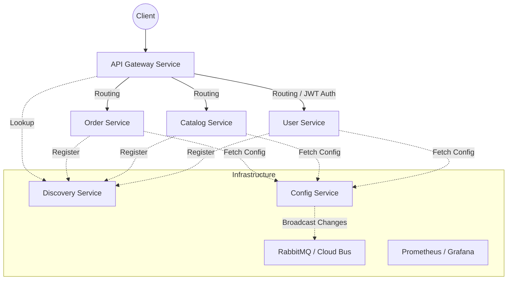

# Spring Cloud 기반 마이크로서비스 아키텍처 (MSA) 실습

본 프로젝트는 **Spring Cloud** 생태계를 활용하여 확장 가능하고 유연한 마이크로서비스 아키텍처(MSA)를 구축하는 실습 과정을 담고 있습니다. 서비스 발견, 중앙 집중형 설정 관리, API 게이트웨이, 분산 추적 등 MSA의 핵심 패턴들을 직접 구현하였습니다.

## 🏗 시스템 아키텍처

---

## 🛠 핵심 구성 요소 (Core Components)

### 1. Discovery Service (Netflix Eureka)
- **역할:** 서비스 레지스트리(Service Registry) 기능을 수행합니다.
- **특징:** 모든 마이크로서비스는 기동 시 자신의 호스트 주소와 포트 정보를 Eureka에 등록합니다. 이를 통해 서비스 간 통신 시 물리적인 주소를 하드코딩하지 않고 서비스 이름만으로 통신이 가능합니다.

### 2. API Gateway Service (Spring Cloud Gateway)
- **역할:** 시스템의 단일 진입점(Single Entry Point)입니다.
- **주요 기능:**
    - **라우팅:** 요청 URL에 따라 적절한 마이크로서비스로 요청을 전달합니다.
    - **인증 및 보안:** JWT(JSON Web Token)를 활용한 필터링을 통해 권한이 없는 접근을 차단합니다.
    - **로깅 및 모니터링:** 요청의 흐름을 추적하고 지표를 수집합니다.

### 3. Config Service (Spring Cloud Config)
- **역할:** 마이크로서비스들의 설정 정보를 중앙에서 관리합니다.
- **연동:** 외부 Git 저장소(`msa-practice-config`)와 연결되어 있으며, 각 서비스는 기동 시 환경별 설정(dev, prod 등)을 서버로부터 가져옵니다.
- **동적 갱신:** **Spring Cloud Bus**와 **RabbitMQ**를 사용하여 설정 변경 시 서버 재시작 없이 모든 서비스에 실시간으로 반영합니다.

---

## 💼 비즈니스 서비스 (Business Services)

| 서비스명 | 주요 역할 | 기술 스택 |
| :--- | :--- | :--- |
| **User Service** | 회원 가입, 로그인, JWT 생성, 사용자 정보 관리 | Spring Boot, JPA, MariaDB, Spring Security |
| **Catalog Service** | 상품 목록 조회, 재고 관리 | Spring Boot, JPA, MariaDB |
| **Order Service** | 주문 처리, 주문 내역 관리 | Spring Boot, JPA, MariaDB |

### 데이터베이스 스키마
프로젝트는 `users`와 `orders` 테이블을 중심으로 간단한 이커머스 도메인을 모델링합니다.
- **Users:** `user_id`, `pwd`, `name`, `created_at` 등 회원 정보 관리
- **Orders:** `product_id`, `qty`, `unit_price`, `total_price`, `order_id` 등 주문 상세 관리

---

## 📈 모니터링 및 운영 (Monitoring & DevOps)

- **Prometheus & Grafana:** 각 서비스의 메트릭을 수집하고 대시보드를 통해 시스템 상태를 시각화합니다.
- **Docker & Docker Compose:** 모든 인프라(RabbitMQ, MariaDB, Prometheus 등)와 마이크로서비스를 컨테이너화하여 일관된 실행 환경을 제공합니다.
- **Zipkin:** 마이크로서비스 간의 복잡한 요청 흐름을 추적하여 병목 지점을 파악합니다.

---

## 🚀 시작하기

1. **인프라 실행:** `docker/` 폴더 내의 설정을 사용하여 필요한 인프라(RabbitMQ, DB 등)를 기동합니다.
2. **Config Server 실행:** 설정 서버가 가장 먼저 구동되어야 합니다.
3. **Discovery Server 실행:** 서비스 레지스트리를 준비합니다.
4. **개별 서비스 실행:** API Gateway와 비즈니스 서비스들을 차례로 실행합니다.

---
*본 문서는 학습용 저장소의 소스코드를 분석하여 자동으로 생성된 가이드입니다.*
