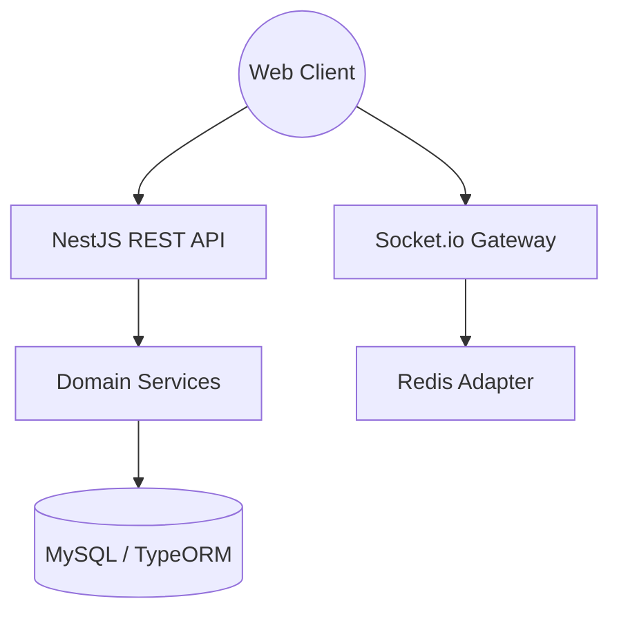

# NestJS 기반 슬랙 클론: 확장 가능한 기업용 채팅 서버 구축

본 프로젝트는 **NestJS** 프레임워크를 활용하여 슬랙(Slack)의 워크스페이스, 채널, DM, 그리고 실시간 채팅 기능을 구현한 고도화된 백엔드 프로젝트입니다. 객체지향 설계 원칙을 준수하며 모듈형 아키텍처를 적용하였습니다.

---

## 🏗 시스템 아키텍처 및 기술 스택



- **Framework:** NestJS (Node.js)
- **Database:** MySQL with TypeORM
- **Real-time:** Socket.io (WebSocket)
- **Security:** Passport, JWT, bcrypt
- **Documentation:** Swagger (OpenAPI)

---

## 🔑 핵심 구현 포인트

### 1. 실시간 통신 (Socket.io Namespace & Room)
단순한 채팅을 넘어 워크스페이스별로 네임스페이스를 동적으로 할당하고, 채널별로 룸을 구성하여 데이터를 격리하였습니다.

```typescript
// src/events/events.gateway.ts
@WebSocketGateway({ namespace: /\/ws-.+/ })
export class EventsGateway implements OnGatewayConnection {
  @SubscribeMessage('login')
  handleLogin(@MessageBody() data: { id: number; channels: number[] }, @ConnectedSocket() socket: Socket) {
    const newNamespace = socket.nsp;
    // 워크스페이스 내 채널별로 Join 처리
    data.channels.forEach((channel) => {
      socket.join(`${socket.nsp.name}-${channel}`);
    });
  }
}
```

### 2. 안정적인 데이터 처리 (TypeORM Transaction)
회원가입 시 사용자 생성과 동시에 기본 워크스페이스 및 채널에 가입시키는 과정에서 데이터 정합성을 보장하기 위해 `QueryRunner`를 통한 수동 트랜잭션을 적용하였습니다.

```typescript
// src/users/users.service.ts
const queryRunner = this.connection.createQueryRunner();
await queryRunner.connect();
await queryRunner.startTransaction();
try {
  const user = await queryRunner.manager.getRepository(Users).save({ ... });
  // 워크스페이스 멤버 추가 등 후속 작업
  await queryRunner.commitTransaction();
} catch (error) {
  await queryRunner.rollbackTransaction();
} finally {
  await queryRunner.release();
}
```

### 3. 모듈형 아키텍처 (Modular Architecture)
- `Auth`: 인증 및 인가 로직 집중
- `Users`: 사용자 계정 및 프로필 관리
- `Workspaces`: 팀별 공간 관리
- `Channels`: 그룹 채팅방 로직
- `DMs`: 1:1 메시지 통신

---

## 🛠 주요 API 명세 및 문서화
NestJS의 `@nestjs/swagger` 모듈을 사용하여 모든 API를 문서화하였습니다. 
- **DTO(Data Transfer Object)**를 사용하여 요청 데이터의 유효성을 검증(ValidationPipe)하고 명확한 인터페이스를 제공합니다.

---

## 📈 학습 포인트
- **Interceptors:** 응답 데이터를 가공하거나 로깅하는 미들웨어 활용법.
- **Custom Decorators:** `@User()`와 같은 커스텀 데코레이터를 통한 코드 가독성 향상.
- **Exception Filters:** 중앙 집중식 에러 처리를 통한 일관된 응답 구조 설계.

---
*본 프로젝트는 실무 수준의 NestJS 백엔드 구조를 이해하기 위한 학습 목적으로 제작되었습니다.*
