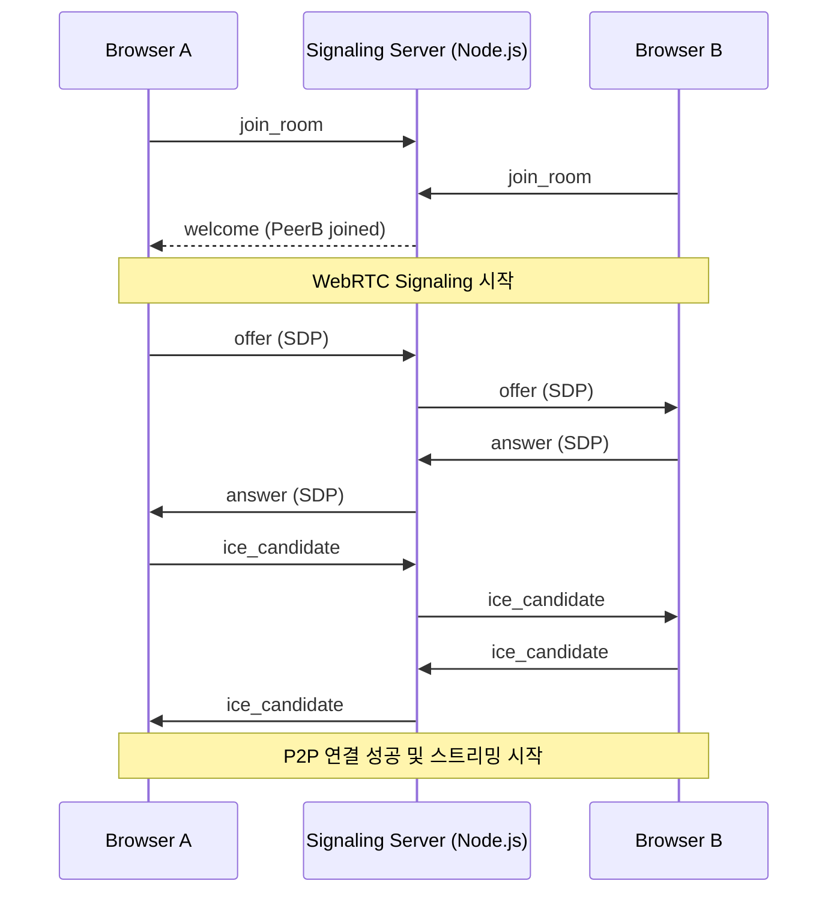

# Node.js 기반 Zoom 클론: WebRTC와 WebSocket으로 만드는 화상 회의 시스템

본 프로젝트는 **WebRTC(Web Real-Time Communication)** 기술을 핵심으로 하여, 브라우저 간의 실시간 비디오/오디오 스트리밍 및 데이터 채널 통신을 구현한 줌(Zoom) 클론 프로젝트입니다.

---

## 🏗 시스템 구성 및 통신 흐름

WebRTC는 P2P(Peer-to-Peer) 방식이지만, 서로의 존재를 알기 위해 초기 정보를 교환해 줄 **Signaling Server**가 반드시 필요합니다.



---

## 🔑 핵심 구현 기술

### 1. WebRTC 시그널링 (Signaling)
브라우저 간에 서로의 미디어 포맷(SDP)과 네트워크 경로(ICE Candidate)를 교환하는 과정입니다. Node.js와 Socket.io를 사용하여 이 과정을 중계합니다.

```javascript
// backend/nodejs/zoom-clone/webrtc/src/server.js
wsServer.on("connection", (socket) => {
  // Offer, Answer, ICE Candidate 중계 로직
  socket.on("offer", (offer, roomName) => {
    socket.to(roomName).emit("offer", offer);
  });
  socket.on("answer", (answer, roomName) => {
    socket.to(roomName).emit("answer", answer);
  });
  socket.on("ice", (ice, roomName) => {
    socket.to(roomName).emit("ice", ice);
  });
});
```

### 2. Media Devices 제어
`navigator.mediaDevices.getUserMedia` API를 사용하여 사용자의 카메라와 마이크에 접근하고 스트림을 관리합니다.

```javascript
// backend/nodejs/zoom-clone/webrtc/src/public/js/app.js
async function getMedia(deviceId) {
  myStream = await navigator.mediaDevices.getUserMedia({
    audio: true,
    video: { deviceId: { exact: deviceId } }
  });
  myFace.srcObject = myStream;
}
```

### 3. P2P 데이터 채널 (Data Channel)
비디오 스트림 외에 텍스트나 파일 데이터를 지연 없이 주고받기 위해 `RTCDataChannel`을 활용합니다.

```javascript
// Peer A (Initiator)
myDataChannel = myPeerConnection.createDataChannel("chat");
myDataChannel.send("Hello Peer B!");

// Peer B (Receiver)
myPeerConnection.addEventListener("datachannel", (event) => {
  const channel = event.channel;
  channel.addEventListener("message", (e) => console.log(e.data));
});
```

---

## 🌐 NAT 트래버설 (STUN Server)
로컬 네트워크(NAT) 뒤에 있는 기기들이 서로의 공용 IP를 찾을 수 있도록 Google에서 제공하는 무료 STUN 서버를 설정하였습니다.

```javascript
myPeerConnection = new RTCPeerConnection({
  iceServers: [{
    urls: [
      "stun:stun.l.google.com:19302",
      "stun:stun1.l.google.com:19302",
    ]
  }]
});
```

---

## 📈 학습 포인트
- **SDP (Session Description Protocol):** 비디오 코덱, 해상도 등 미디어 설정을 담은 데이터 이해.
- **ICE (Internet Connectivity Establishment):** 복잡한 네트워크 환경에서 최적의 연결 경로를 찾는 과정.
- **Signaling의 한계:** 1:1 통신은 쉽지만, 다대다(Mesh) 통신 시 클라이언트 부하가 급증하는 문제(SFU/MCU의 필요성) 체감.

---
*본 프로젝트는 실시간 웹 통신의 핵심 기술인 WebRTC의 기초를 탄탄히 다지기 위해 제작되었습니다.*
