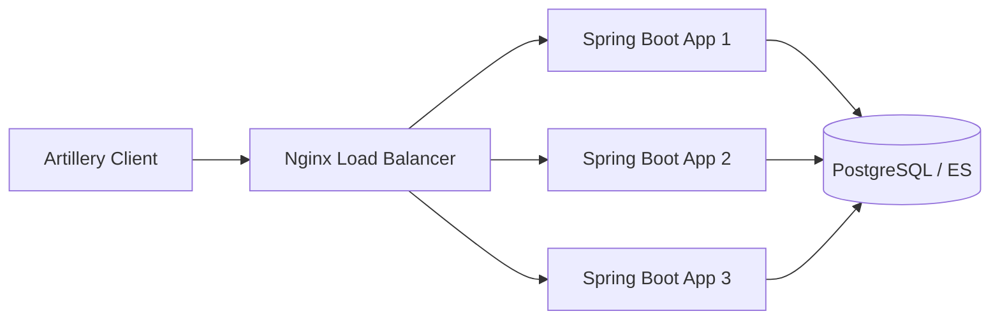

# 부하 테스트와 성능 최적화: Artillery를 활용한 시스템 한계 분석

시스템이 얼마나 많은 사용자를 수용할 수 있을까요? 본 프로젝트는 **Artillery** 부하 테스트 도구를 사용하여 애플리케이션의 성능 병목 지점을 파악하고, 최적화 전략을 수립하는 실습 과정을 담고 있습니다.

---

## 🏗 테스트 환경 아키텍처



---

## ⚖️ CPU-bound vs IO-bound 분석

성능 테스트 시 가장 먼저 이해해야 할 것은 애플리케이션의 성격입니다.

### 1. CPU-bound 애플리케이션
- **특징:** 복잡한 연산, 암호화, 이미지 처리 등 CPU 자원을 많이 소모합니다.
- **실습 예시:** 비밀번호 해싱 알고리즘 (BCrypt 등) 처리.
- **테스트 시나리오 (`cpu-test.yaml`):**
    ```yaml
    config:
      target: "http://your-app-url"
      phases:
        - duration: 300  # 5분간 테스트
          arrivalRate: 2 # 초당 2명의 새로운 사용자 유입
    scenarios:
      - name: "Hash computation"
        flow:
          - get:
              url: "/hash/123"
    ```
- **최적화 전략:** 서버 스케일 업(CPU 성능 향상) 또는 워커 스레드 최적화가 필요합니다.

### 2. IO-bound 애플리케이션
- **특징:** 데이터베이스 조회, 외부 API 호출, 파일 읽기/쓰기 등 대기 시간이 발생합니다.
- **실습 예시:** 대규모 데이터 조회 또는 외부 서비스 연동.
- **최적화 전략:** 커넥션 풀(Connection Pool) 최적화, 캐싱(Redis), 비동기 Non-blocking I/O 도입이 효과적입니다.

---

## 🛠 주요 도구 및 설정

### Nginx 로드 밸런싱 설정
여러 대의 인스턴스로 부하를 분산하여 고가용성을 확보합니다.
```nginx
upstream performance-app {
  server 10.0.0.1:8080 weight=100;
  server 10.0.0.2:8080 weight=100;
}

location / {
  proxy_pass http://performance-app;
  proxy_set_header Host $host;
}
```

### 모니터링 및 인프라
- **Artillery:** 실시간 응답 시간(p95, p99) 및 처리량(TPS) 측정.
- **Prometheus & Grafana:** 서버 자원(CPU, Memory) 사용률 시각화.
- **Docker:** 일관된 테스트 환경 구축을 위해 PostgreSQL, RabbitMQ, ElasticSearch 등을 컨테이너로 실행.

---

## 📈 성능 측정 결과 해석 (Interpretation)
- **Latencies (p95):** 95%의 사용자가 경험하는 응답 시간입니다. 이 수치가 급격히 올라가면 시스템이 포화 상태임을 의미합니다.
- **Scenarios created/completed:** 유입된 사용자가 정상적으로 요청을 마치고 나갔는지 확인합니다. 차이가 크다면 에러가 발생하고 있는 것입니다.

---
*본 문서는 Artillery를 이용한 실제 성능 테스트 데이터를 기반으로 작성되었습니다.*
