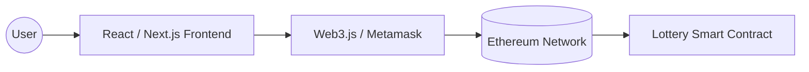

# 탈중앙화 복권 서비스 (Lottery DApp): 스마트 컨트랙트와 Web3 실습

본 프로젝트는 **Ethereum** 블록체인 네트워크 상에서 구동되는 투명하고 공정한 복권 시스템(Lottery)을 개발한 실습 공간입니다. **Solidity**를 이용한 스마트 컨트랙트 작성부터 프런트엔드 연동까지의 전 과정을 포함합니다.

---

## 🏗 시스템 아키텍처



---

## 🔑 스마트 컨트랙트 핵심 로직 (Solidity)

복권의 핵심은 **"공정한 정답 생성"**과 **"정확한 자금 분배"**입니다. 본 프로젝트는 미래의 블록 해시값을 예측하는 방식을 사용하여 예측 불가능성을 확보하였습니다.

### 1. 베팅 (Betting)
사용자는 정해진 금액(0.005 ETH)과 함께 미래 블록의 해시값 일부를 예측하여 전송합니다.

```solidity
// blockchain/lottery-dapp/contracts/Lottery.sol
function bet(bytes1 challenges) public payable returns (bool) {
    require(msg.value == BET_AMOUNT, "Not enough ETH"); // 베팅 금액 확인

    // 베팅 정보 저장 (미래의 블록 번호 지정)
    require(pushBet(challenges), "Fail to add new Bet Info");

    // 이벤트 발행 (프런트엔드에서 실시간 감지 가능)
    emit BET(_tail - 1, msg.sender, msg.value, challenges, block.number + BET_BLOCK_INTERVAL);
    return true;
}
```

### 2. 정답 확인 및 분배 (Distribute)
지정된 블록이 생성된 후, 실제 해시값과 사용자의 예측값을 비교하여 당첨금을 분배합니다.

```solidity
if(result == BettingResult.Win) {
    // 팟머니(Pot) 전체와 베팅액을 당첨자에게 전송
    transferAmount = transferAfterPayingFee(b.gambler, _pot + BET_AMOUNT);
    _pot = 0;
    emit WIN(cur, b.gambler, transferAmount, b.challenges, answer[0], b.answerBlockNumber);
}
```

---

## 🛠 주요 기술 및 도구
- **Solidity:** 스마트 컨트랙트 프로그래밍 언어.
- **Truffle / Hardhat:** 컨트랙트 컴파일, 배포, 테스트 프레임워크.
- **Web3.js / Ethers.js:** 브라우저와 블록체인 노드 간의 통신 라이브러리.
- **Metamask:** 사용자의 지갑 관리 및 트랜잭션 서명 도구.

---

## 📉 블록체인 개발의 핵심 포인트
- **Gas Fee:** 모든 연산과 데이터 저장에는 비용이 발생하므로 코드 최적화가 필수적임.
- **Immutability:** 한 번 배포된 컨트랙트는 수정할 수 없으므로 철저한 테스트(`test/` 폴더 내 스크립트)가 중요함.
- **Randomness:** 블록체인 내부에서는 진정한 난수 생성이 어려움. 본 프로젝트에서는 `blockhash`를 활용하여 이를 해결함.

---
*본 프로젝트는 중앙 주체 없이 코드만으로 돌아가는 신뢰 기반의 서비스를 구축하는 경험을 제공합니다.*
