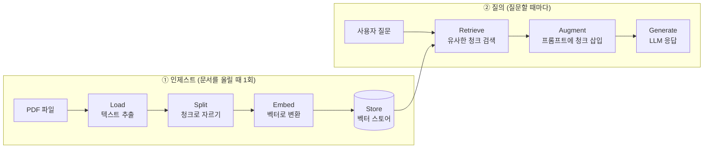
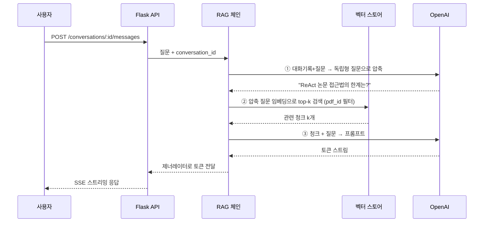

이 시리즈는 **PDF를 업로드하면 그 내용에 대해 대화할 수 있는 앱**을 처음부터 만들어 보는 글입니다.
저장소의 `ai/langchain/udemy-masterclass/pdf-app` 코드를 교재 삼아, 실제로 돌아가는 앱이
어떤 조각으로 이루어져 있는지 한 겹씩 벗겨 봅니다.

**대상 독자**는 이렇습니다.

- 웹 백엔드나 프론트엔드 개발 경험은 있지만 **LLM 앱은 처음**인 분
- ChatGPT API는 써 봤지만 "**내 문서**로 답하게 만드는 법"이 막막한 분
- RAG라는 말은 들어봤는데 **어디까지가 필수이고 어디부터가 과잉인지** 감이 안 오는 분

머신러닝 지식은 필요 없습니다. Python 문법과 HTTP 요청/응답 정도만 알면 따라올 수 있게 썼습니다.
수식이 나오는 곳은 딱 한 군데(3편의 코사인 유사도)이고, 그마저도 "왜 이렇게 계산하는가"만 이해하면 됩니다.

## 먼저 용어부터

앞으로 계속 나올 단어들입니다. 지금 완벽히 이해하지 않아도 됩니다. 각 편에서 코드와 함께 다시 설명합니다.

| 용어 | 한 줄 설명 |
|------|-----------|
| **LLM** | GPT 같은 대규모 언어 모델. 텍스트를 넣으면 텍스트를 만들어 냅니다. |
| **프롬프트(Prompt)** | LLM에게 보내는 입력 전체. 지시문 + 참고 자료 + 질문이 다 여기 들어갑니다. |
| **컨텍스트 윈도우** | 한 번에 프롬프트로 넣을 수 있는 최대 분량. 이걸 넘으면 오류가 나거나 잘립니다. |
| **임베딩(Embedding)** | 텍스트를 숫자 배열(벡터)로 바꾼 것. 의미가 비슷하면 벡터도 가까워집니다. |
| **벡터 스토어** | 임베딩을 저장하고 "이 벡터랑 가까운 것 찾아줘"를 빠르게 해 주는 데이터베이스. |
| **청크(Chunk)** | 긴 문서를 검색하기 좋게 자른 조각. 보통 수백~수천 자 단위입니다. |
| **리트리버(Retriever)** | 질문을 받아 관련 있는 청크를 골라 오는 컴포넌트. |
| **RAG** | Retrieval-Augmented Generation. 검색해 온 자료를 프롬프트에 넣어 LLM이 답하게 하는 방식. |
| **LangChain** | 위 조각들을 조립해 주는 Python/JS 라이브러리. 이 시리즈에서 계속 씁니다. |

## RAG는 왜 필요한가

LLM에는 두 가지 확실한 한계가 있습니다.

**1. 모르는 데이터가 있다.** 모델은 학습 시점까지의 공개 데이터만 압니다.
우리 회사 위키, 어제 올라온 계약서 PDF, 사내 API 문서는 당연히 모릅니다.
모르는 걸 물으면 "모릅니다"라고 하면 좋겠지만, 실제로는 **그럴듯하게 지어내는(환각, hallucination)** 일이 잦습니다.

**2. 다 넣을 수는 없다.** "그럼 PDF 300페이지를 통째로 프롬프트에 넣으면 되잖아?"
컨텍스트 윈도우가 커진 요즘은 물리적으로 가능한 경우도 있습니다. 하지만

- 요청 한 번마다 문서 전체 토큰 값을 냅니다. 질문 100번이면 100번 다 냅니다.
- 입력이 길수록 응답이 느려집니다.
- 긴 입력의 **가운데에 있는 정보를 모델이 잘 놓치는 현상**(lost in the middle)이 알려져 있습니다.

RAG는 아주 단순한 전략으로 둘을 동시에 해결합니다.

> **질문과 관련 있는 조각만 골라서 프롬프트에 넣어 준다.**

즉 RAG = **검색(Retrieval)** + **프롬프트 주입(Augmentation)** + **생성(Generation)** 입니다.
파인튜닝처럼 모델을 다시 학습시키지 않아도 되고, 문서가 바뀌면 인덱스만 다시 만들면 됩니다.

여기서 이 시리즈 전체를 관통하는 문장 하나를 기억해 두세요.

> **검색 품질이 답변 품질의 상한선이다.**

엉뚱한 청크를 물어다 주면 GPT-5를 붙여도 좋은 답이 나올 수 없습니다.
반대로 검색이 정확하면 작고 저렴한 모델로도 충분한 경우가 많습니다.
그래서 이 시리즈는 모델 이야기보다 **청킹과 검색** 이야기에 훨씬 많은 지면을 씁니다.

## RAG 앱은 항상 두 개의 파이프라인이다

이게 RAG의 큰 그림입니다. 앞으로 나오는 모든 코드는 둘 중 하나에 속합니다.



**① 인제스트(ingest)는 오프라인 작업**입니다. 문서를 업로드할 때 한 번만 돌면 됩니다.
느려도 되지만(수십 초~수 분), 사용자를 기다리게 하면 안 되므로 보통 **백그라운드 작업 큐**로 넘깁니다(8편).

**② 질의는 온라인 작업**입니다. 메시지를 보낼 때마다 실행되고, 사용자가 눈앞에서 기다리므로
**빠르고 스트리밍**되어야 합니다(7편).

RAG를 처음 배울 때 가장 흔한 혼란이 "이 코드가 언제 실행되는 코드인지" 헷갈리는 것입니다.
파일을 열 때마다 **"이건 ①인가 ②인가"** 를 먼저 물어보세요. 그것만으로 절반은 이해한 셈입니다.

## 우리가 읽을 앱: pdf-app

`pdf-app`은 위 두 파이프라인을 실제 서비스 형태로 구현한 앱입니다. 구조는 이렇습니다.

```text
pdf-app/
├── app/
│   ├── web/                    # Flask 웹 서버 (②의 입구, ①의 트리거)
│   │   ├── views/              #   업로드·대화·점수 API
│   │   ├── db/models/          #   User, Pdf, Conversation, Message
│   │   ├── tasks/embeddings.py #   Celery 태스크 (① 진입점)
│   │   └── files.py            #   파일 업로드·다운로드
│   ├── chat/                   # RAG 본체
│   │   ├── create_embeddings.py#   ① Load → Split → Embed → Store
│   │   ├── vector_stores/      #   ② 벡터 스토어와 리트리버
│   │   ├── llms/               #   ② LLM 후보들
│   │   ├── memories/           #   ② 대화 기록
│   │   ├── chains/             #   ② 체인 조립 + 스트리밍
│   │   ├── callbacks/          #   ② 토큰 스트리밍 콜백
│   │   └── score.py            #   사용자 평가 되먹임
│   └── celery/                 # 워커 설정
└── client/                     # SvelteKit 프론트엔드
```

기술 스택은 다음과 같습니다.

| 구분 | 사용 기술 | 역할 |
|------|-----------|------|
| 웹 서버 | Flask | 업로드·대화 API, SSE 스트리밍 |
| 작업 큐 | Celery + Redis | 임베딩 생성을 비동기로 처리 |
| LLM/임베딩 | OpenAI | 답변 생성, 텍스트 → 벡터 |
| 벡터 DB | Pinecone | 청크 벡터 저장·검색 |
| 앱 DB | SQLite(SQLAlchemy) | 사용자·PDF·대화·메시지 |
| 관측 | Langfuse | 체인 실행 추적 |
| 프론트 | SvelteKit | 채팅 UI, 스트리밍 수신 |

한 번에 다 필요하지는 않습니다. **1편에서는 파일 하나짜리 스크립트로 시작**해서,
편이 넘어갈 때마다 조각을 하나씩 붙여 이 구조에 도달합니다.

## 질문 하나가 처리되는 전체 흐름

3편~7편에서 다룰 내용을 미리 한 장에 담으면 이렇습니다.



여기서 눈여겨볼 것이 **LLM을 두 번 호출한다**는 점입니다.
"그거 한계가 뭐야?" 같은 후속 질문은 그 문장만으로는 검색할 수 없기 때문에,
먼저 대화 기록을 참고해 **혼자서도 말이 되는 질문**으로 다시 쓴 다음 검색합니다.
대화형 RAG의 핵심이자 함정이며, 6편에서 자세히 다룹니다.

## 이 시리즈를 따라가려면

```bash
python --version   # 3.10 이상 권장
```

필요한 것은 **Python 3.10+**와 **OpenAI API 키** 하나입니다.
1편에서 설치와 키 설정을 처음부터 안내합니다.
Pinecone·Redis·Celery는 8편 전까지 필요 없고, 그때도 "왜 필요해지는가"를 먼저 설명한 뒤에 붙입니다.

앞으로 쓸 LangChain 코드는 **패키지가 분리된 최신 구조**(`langchain-openai`, `langchain-community` 등) 기준입니다.
`pdf-app`은 `langchain==0.0.352` 시절 코드라 임포트 경로가 다른데,
차이가 있는 곳마다 "옛 코드 → 지금 코드"를 나란히 보여 드립니다.
**개념은 그대로**이므로 옛 코드를 읽는 것은 여전히 가치가 있습니다.

## 시리즈 목차

| 회차 | 단계 | 글 |
|------|------|----|
| 00 | 개요 | [PDF와 대화하는 앱, 무엇을 어떻게 만드나](./00-rag-overview.pub.md) |
| 01 | 최소 구현 | [20줄로 만드는 첫 RAG](./01-first-rag-in-20-lines.pub.md) |
| 02 | 인제스트 | [문서 로드와 청킹 — RAG의 첫 번째 승부처](./02-load-and-split.pub.md) |
| 03 | 인제스트 | [임베딩과 벡터 스토어 — 의미로 검색한다는 것](./03-embeddings-and-vector-store.pub.md) |
| 04 | 질의 | [리트리버 — 검색 품질이 답변의 상한선](./04-retriever-and-search-quality.pub.md) |
| 05 | 질의 | [프롬프트와 생성 — 환각을 줄이고 출처를 붙이기](./05-prompt-and-generation.pub.md) |
| 06 | 질의 | [대화형 RAG — 질문 압축과 메모리](./06-conversational-rag.pub.md) |
| 07 | 서비스화 | [토큰 스트리밍 — 콜백, SSE, 그리고 run_id 함정](./07-streaming.pub.md) |
| 08 | 서비스화 | [업로드와 비동기 인제스트 — Flask + Celery + Redis](./08-async-ingestion.pub.md) |
| 09 | 운영 | [실험과 평가 — 감이 아니라 숫자로 고르기](./09-evaluation-and-experiments.pub.md) |
| 10 | 운영 | [프로덕션 체크리스트와 흔한 함정](./10-production-checklist.pub.md) |

## 미리 알아두면 좋은 것

- **1~5편만 읽어도 동작하는 RAG가 나옵니다.** 6편부터는 "서비스로 만들기 위한" 이야기입니다.
- **코드는 전부 복사해서 실행할 수 있게** 썼습니다. 각 편 끝에 실습 과제를 붙였습니다.
- **정답이 하나가 아닌 선택**(청크 크기, k, 모델)에는 "출발점 값"과 "튜닝하는 방법"을 함께 적었습니다.

다음 편에서는 PDF 한 개를 놓고 **20줄짜리 RAG**를 실제로 돌려 봅니다.
