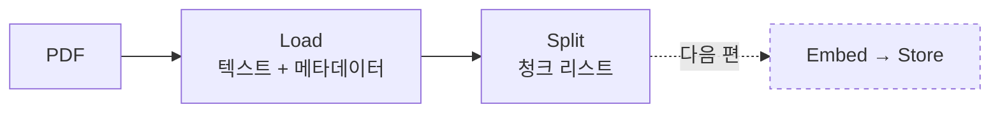

RAG에서 가장 과소평가되는 단계가 **청킹**입니다.
모델을 바꾸거나 프롬프트를 다듬는 것보다, 청크를 제대로 자르는 쪽이 답변 품질을 크게 바꾸는 일이 흔합니다.
이번 편은 인제스트 파이프라인의 앞 절반, **Load와 Split**입니다.



## 1. Load — PDF에서 텍스트 꺼내기

### 로더 고르기

LangChain에는 PDF 로더가 여러 개 있습니다. 결과물이 꽤 다릅니다.

| 로더 | 특징 | 언제 쓰나 |
|------|------|-----------|
| `PyPDFLoader` | `pypdf` 기반. 가볍고 페이지 번호를 넣어 줍니다. | **기본값.** 텍스트 위주 문서 |
| `PyMuPDFLoader` | 빠르고 레이아웃 보존이 나은 편 | 2단 편집·복잡한 레이아웃 |
| `PDFPlumberLoader` | 표 추출에 강함 | 표가 많은 보고서 |
| `UnstructuredPDFLoader` | 제목·표·리스트 등 **구조를 인식** | 구조를 살리고 싶을 때 |

`pdf-app`은 가장 단순한 `PyPDFLoader`를 씁니다. 처음에는 이걸로 시작하고,
**추출된 텍스트를 눈으로 확인한 뒤** 불만이 있을 때 바꾸는 순서를 권합니다.

```python
from langchain_community.document_loaders import PyPDFLoader

pages = PyPDFLoader("paper.pdf").load()
print(f"{len(pages)} 페이지")
print(pages[0].metadata)          # {'source': 'paper.pdf', 'page': 0, ...}
print(pages[0].page_content[:500])
```

### 추출 품질부터 확인하기

PDF는 "글자가 어디에 그려져 있는지"를 담은 형식이라, 텍스트가 항상 사람이 읽는 순서로 나오지 않습니다.
인제스트를 돌리기 전에 **반드시 몇 페이지를 눈으로 확인**하세요.

자주 만나는 문제들입니다.

| 증상 | 원인 | 대응 |
|------|------|------|
| `page_content`가 빈 문자열 | 스캔 이미지 PDF | OCR 필요 (아래) |
| 단어 사이에 줄바꿈이 끼어듦 | 2단 편집, 하이픈 줄바꿈 | 전처리로 정리하거나 다른 로더 |
| 표가 뭉개져 한 줄로 | 표 구조 손실 | `PDFPlumberLoader`/`Unstructured` |
| 머리말·쪽번호가 매 페이지 반복 | 헤더/푸터 | 전처리로 제거 |

스캔 PDF는 OCR이 먼저입니다. 텍스트 레이어가 없는 PDF에 RAG를 붙이면
"검색이 아무것도 못 찾는" 상태가 되는데, 원인을 찾기가 의외로 어렵습니다.

```bash
# OCRmyPDF로 텍스트 레이어를 입힌 뒤 로드
ocrmypdf --language kor+eng input.pdf output.pdf
```

간단한 전처리는 로드 직후에 해 두면 이후 단계가 모두 깨끗해집니다.

```python
import re

def clean(text: str) -> str:
    text = re.sub(r"-\n(?=[a-z])", "", text)   # 영문 하이픈 줄바꿈 복원
    text = re.sub(r"[ \t]+", " ", text)        # 연속 공백 정리
    text = re.sub(r"\n{3,}", "\n\n", text)     # 빈 줄 3개 이상 → 2개
    return text.strip()

for page in pages:
    page.page_content = clean(page.page_content)
```

## 2. Split — 왜 자르는가

"페이지 단위로 저장하면 안 되나?" 싶지만, 안 되는 이유가 분명합니다.

- **검색이 뭉툭해진다.** 한 페이지에 여러 주제가 섞이면 그 페이지 벡터는 어느 주제와도 어중간하게 비슷해집니다.
- **프롬프트가 낭비된다.** 필요한 두 문장을 얻으려고 페이지 전체를 넣게 됩니다.
- **노이즈가 함께 들어간다.** 관련 없는 문단이 같이 들어가면 LLM이 그쪽에 끌려갑니다.

반대로 너무 잘게 자르면 이런 일이 생깁니다.

- **문맥이 끊긴다.** "이 방식은 정확도를 12% 높였다"만 남고 "이 방식"이 뭔지가 다른 청크로 가 버립니다.
- **대명사가 미아가 된다.** "그것은", "위 표에서" 같은 표현이 근거를 잃습니다.

그래서 청킹은 **"의미가 온전히 담기는 가장 작은 단위"** 를 찾는 작업입니다.

### chunk_size 감 잡기

| 청크 크기 | 성격 | 어울리는 문서 |
|-----------|------|---------------|
| 200~400자 | 정밀 검색, 문맥 부족 | FAQ, 용어집, 짧은 Q&A |
| **500~1000자** | **일반적인 출발점** | 논문, 매뉴얼, 블로그 |
| 1500~2500자 | 문맥 풍부, 노이즈 증가 | 법률·계약서, 서술형 보고서 |

`pdf-app`은 500자를 쓰고, 1편의 스크립트는 1000자를 썼습니다.
**500자는 다소 작은 편**입니다. 한국어 기술 문서라면 800~1200자에서 시작해 보길 권합니다.

### chunk_overlap이 하는 일

겹침이 없으면 경계에서 이런 사고가 납니다.

```text
[청크 1] ... 이 문제를 해결하기 위해 우리는 두 단계 파이프라인을 제안한다. 첫 번째
[청크 2] 단계는 후보를 생성하고, 두 번째 단계는 재순위화한다. 실험 결과 ...
```

"두 단계 파이프라인이 뭐야?"라고 물으면 청크 1은 설명이 잘려 있고, 청크 2는 주어가 없습니다.
겹침을 주면 청크 2가 앞의 일부를 다시 포함해 양쪽 다 말이 되게 만듭니다.

**출발점은 `chunk_size`의 10~20%** 입니다. 1000자면 100~200자.
너무 키우면 같은 문장이 여러 청크에 중복 저장되어 저장 비용과 중복 검색이 늘어납니다.

### RecursiveCharacterTextSplitter는 어떻게 자르는가

이름의 "Recursive"가 핵심입니다. 이 분할기는 **의미 단위가 큰 구분자부터 차례로 시도**합니다.

```python
from langchain_text_splitters import RecursiveCharacterTextSplitter

splitter = RecursiveCharacterTextSplitter(
    chunk_size=1000,
    chunk_overlap=150,
    separators=["\n\n", "\n", " ", ""],   # 기본값
)
chunks = splitter.split_documents(pages)
```

동작 순서는 이렇습니다.

1. `\n\n`(빈 줄, 즉 **문단 경계**)로 자른다.
2. 조각이 여전히 `chunk_size`보다 크면, 그 조각을 `\n`(**줄 경계**)으로 다시 자른다.
3. 그래도 크면 ` `(**단어 경계**)로 자른다.
4. 최후에는 `""`(글자 단위)로 자른다.
5. 자른 조각들을 `chunk_size`를 넘지 않는 선에서 다시 이어 붙인다.

덕분에 문단 구조가 최대한 보존됩니다. 단순 `CharacterTextSplitter`가 글자 수만 세고 뚝 자르는 것과의 차이입니다.

한국어 문서라면 문장 종결부를 구분자에 추가하는 것이 도움이 됩니다.

```python
splitter = RecursiveCharacterTextSplitter(
    chunk_size=1000,
    chunk_overlap=150,
    separators=["\n\n", "\n", ". ", "다. ", "? ", "! ", " ", ""],
)
```

### 글자 수인가 토큰 수인가

`chunk_size`는 기본적으로 **글자 수**입니다. 하지만 LLM의 컨텍스트 한계는 **토큰** 단위죠.
한국어는 영어보다 글자당 토큰 수가 많아서, 같은 500자라도 토큰 수가 꽤 다릅니다.
프롬프트 예산을 정확히 계산하고 싶다면 토큰 기준으로 자릅니다.

```python
splitter = RecursiveCharacterTextSplitter.from_tiktoken_encoder(
    encoding_name="cl100k_base",
    chunk_size=400,        # 이제 단위는 토큰
    chunk_overlap=60,
)
```

`tiktoken` 패키지가 필요합니다(`pip install tiktoken`).
처음에는 글자 수로 시작해도 충분하고, 컨텍스트가 빠듯해질 때 토큰 기준으로 옮기면 됩니다.

### 구조가 있는 문서라면

마크다운·HTML처럼 제목 구조가 있다면, 구조를 먼저 살리고 그 안에서 자르는 편이 훨씬 낫습니다.

```python
from langchain_text_splitters import MarkdownHeaderTextSplitter

header_splitter = MarkdownHeaderTextSplitter(
    headers_to_split_on=[("#", "h1"), ("##", "h2"), ("###", "h3")]
)
sections = header_splitter.split_text(markdown_text)
# 각 조각의 metadata에 h1/h2/h3가 들어가 "어느 섹션인지"를 알 수 있다
```

섹션 제목이 메타데이터로 남으면 답변에 "3.2절 참고" 같은 출처를 붙일 수 있습니다.

## 3. `pdf-app`의 인제스트 코드 읽기

`app/chat/create_embeddings.py`가 이 두 단계를 그대로 담고 있습니다.

```python
def create_embeddings_for_pdf(pdf_id: str, pdf_path: str):
    text_splitter = RecursiveCharacterTextSplitter(chunk_size=500, chunk_overlap=100)

    loader = PyPDFLoader(pdf_path)
    docs = loader.load_and_split(text_splitter)   # ① Load + ② Split

    for doc in docs:
        doc.metadata = {
            "page": doc.metadata["page"],
            "text": doc.page_content,
            "pdf_id": pdf_id,
        }

    vector_store.add_documents(docs)              # ③ Embed + ④ Store
```

### `load_and_split` vs `load` + `split_documents`

`load_and_split(splitter)`는 로드와 분할을 한 번에 합니다. 편하지만,
**중간 결과(페이지 텍스트)를 볼 수 없다**는 단점이 있습니다.
전처리를 넣거나 추출 품질을 확인하려면 두 단계로 나누는 편이 낫습니다.

```python
docs = loader.load()
# 여기서 clean(), 헤더 제거, 로그 출력 등 원하는 처리
chunks = text_splitter.split_documents(docs)
```

### 메타데이터 설계가 두 번째 승부처

위 코드에서 진짜 중요한 부분은 `doc.metadata`를 다시 채우는 세 줄입니다.

| 키 | 왜 넣나 |
|----|--------|
| `pdf_id` | **검색 범위를 이 문서로 한정**하는 필터 키. 없으면 A 문서를 물었는데 B 문서로 답하는 사고가 납니다. |
| `page` | 답변에 "몇 페이지"를 붙이기 위한 출처 정보. |
| `text` | 청크 원문. LangChain의 Pinecone 연동이 기본적으로 `text` 키에서 본문을 복원합니다. |

`text` 키가 낯설 수 있는데, 이유가 있습니다. Pinecone은 벡터와 메타데이터만 저장하고
원문 텍스트를 따로 보관하지 않습니다. 그래서 검색 후 `Document.page_content`를 되살리려면
원문을 메타데이터에 함께 넣어 둬야 합니다. FAISS 같은 로컬 스토어는 원문을 자체 보관하므로 이 작업이 필요 없습니다.

다만 위 코드에는 아쉬운 점이 하나 있습니다. `doc.metadata`를 **통째로 교체**하는 바람에
`PyPDFLoader`가 넣어 준 `source`(파일명) 같은 정보가 사라집니다. 이렇게 하면 더 안전합니다.

```python
for doc in docs:
    doc.metadata = {
        **doc.metadata,          # source, page 등 원본 정보 유지
        "text": doc.page_content,
        "pdf_id": pdf_id,
        "user_id": user_id,      # 멀티테넌트라면 필수 (4편)
    }
```

**메타데이터에는 나중에 필터로 쓸 값을 미리 심어 두세요.**
인제스트를 다시 돌리는 것은 비싼 작업이라, 나중에 "user_id로 걸러야 하는데 없네"를 깨달으면
전체 문서를 재인덱싱해야 합니다.

## 4. 내 청킹이 괜찮은지 확인하는 법

숫자와 눈, 두 가지로 봅니다.

```python
lengths = [len(c.page_content) for c in chunks]
print(f"청크 수: {len(chunks)}")
print(f"평균 {sum(lengths)//len(lengths)}자 / 최소 {min(lengths)} / 최대 {max(lengths)}")

# 지나치게 짧은 청크 = 의미 없는 파편일 가능성이 높다
tiny = [c for c in chunks if len(c.page_content) < 100]
print(f"100자 미만: {len(tiny)}개")
for c in tiny[:5]:
    print(" -", repr(c.page_content[:80]))
```

100자 미만 청크가 잔뜩 나온다면 표·머리말·쪽번호가 파편으로 남은 경우가 많습니다.
검색 결과만 오염시키므로 걸러내는 편이 낫습니다.

```python
chunks = [c for c in chunks if len(c.page_content.strip()) >= 100]
```

그리고 **무작위로 다섯 개를 뽑아 직접 읽어 보세요.**
"이 조각만 보고 질문에 답할 수 있는가?"가 기준입니다.
못 하겠다면 청크가 너무 작거나, 경계가 잘못 잡힌 것입니다.

```python
import random
for c in random.sample(chunks, 5):
    print("=" * 60)
    print(c.metadata)
    print(c.page_content)
```

## 5. 정리

- 로더는 `PyPDFLoader`로 시작하되, **추출 결과를 눈으로 확인**한다.
- 스캔 PDF는 OCR이 먼저다. 아니면 아무것도 검색되지 않는다.
- `chunk_size`는 500~1000자에서 시작. 문서 성격에 따라 조정한다.
- `chunk_overlap`은 `chunk_size`의 10~20%.
- `RecursiveCharacterTextSplitter`는 문단 → 줄 → 단어 순으로 자른다. 한국어면 문장 구분자를 추가한다.
- 메타데이터에는 **나중에 필터로 쓸 값**(`pdf_id`, `user_id`)과 **출처 정보**(`page`)를 심는다.

## 실습

1. 같은 PDF를 `chunk_size` 300 / 1000 / 2000으로 각각 나눠 청크 수와 평균 길이를 비교해 보세요.
2. `separators`에서 `"\n\n"`을 빼고 잘라 보세요. 청크 경계가 어떻게 나빠지는지 확인해 보세요.
3. 청크에 `"source": 파일명`을 넣어 두고, 나중에 파일별로 검색을 나눌 준비를 해 보세요.

다음 편에서는 이 청크들을 **벡터로 바꿔 저장**합니다. 임베딩이 정확히 무엇이고,
왜 "의미가 비슷하면 벡터가 가까운지" 살펴봅니다.
