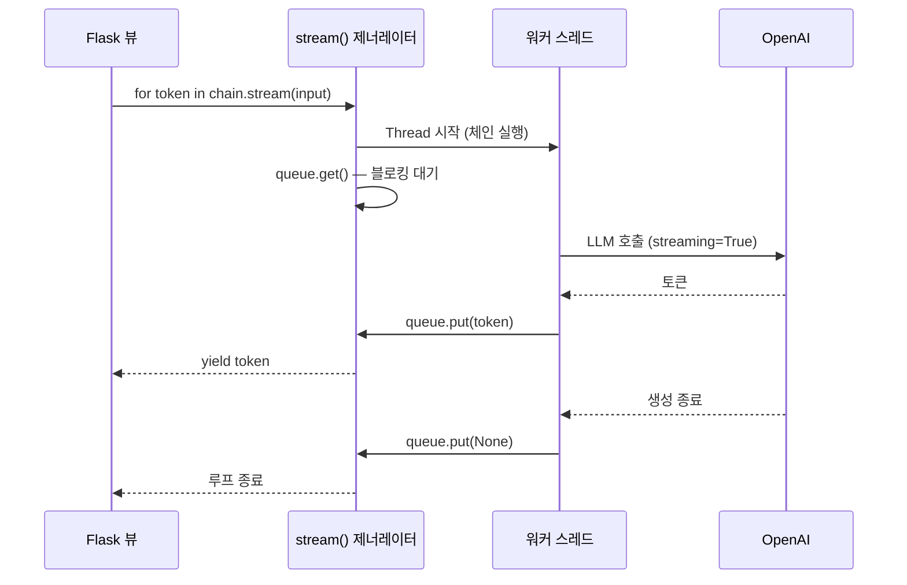

지금까지 만든 RAG는 답이 다 만들어질 때까지 **아무것도 보여 주지 않습니다.**
검색 + LLM 두 번 호출이면 체감 5초, 10초는 금방입니다. 그 시간 동안 화면이 멈춰 있으면
사용자는 고장 났다고 생각합니다.

스트리밍은 실제 속도를 바꾸지 않지만 **체감 속도를 완전히 바꿉니다.**
첫 글자가 0.5초 만에 나오기 시작하면, 전체가 10초 걸려도 기다릴 만합니다.

## 1. 가장 간단한 스트리밍

최신 LangChain에서는 `invoke` 대신 `stream`을 부르면 됩니다.

```python
for chunk in rag_chain.stream({"input": "이 문서의 핵심은?"}):
    if "answer" in chunk:
        print(chunk["answer"], end="", flush=True)
```

`create_retrieval_chain`은 여러 단계로 이루어져 있어서, 흘러나오는 조각에 여러 키가 섞여 있습니다.

| 키 | 내용 |
|----|------|
| `input` | 원래 질문 |
| `context` | 검색된 문서 (검색이 끝난 시점에 한 번) |
| `answer` | **LLM이 만들어 내는 토큰 조각** |

그래서 `if "answer" in chunk` 로 걸러 냅니다.
검색 문서가 먼저 도착하므로, "근거 문서 표시 → 답변 스트리밍" 순으로 UI를 구성할 수 있습니다.

더 세밀하게 제어하고 싶다면 이벤트 스트림을 씁니다.

```python
async for event in rag_chain.astream_events({"input": q}, version="v2"):
    kind = event["event"]
    if kind == "on_retriever_end":
        print("검색 완료:", len(event["data"]["output"]), "개")
    elif kind == "on_chat_model_stream":
        print(event["data"]["chunk"].content, end="")
```

체인 안에서 벌어지는 모든 일(검색 시작/끝, 각 LLM의 토큰)이 이벤트로 나옵니다.
어떤 LLM의 토큰인지 구분하는 것도 여기서는 `event["name"]`이나 태그로 처리할 수 있습니다.

## 2. `pdf-app`은 왜 직접 만들었나

`pdf-app`이 쓰는 `langchain==0.0.352`에는 `stream()`이 없었습니다.
체인 실행이 **블로킹 함수 호출**이라, 결과가 다 나올 때까지 반환되지 않았죠.
그래서 직접 만들었습니다. 지금은 필요 없는 코드지만, **콜백과 스트리밍의 원리를 이해하는 데는 훌륭한 교재**입니다.

`app/chat/chains/streamable.py`:

```python
class StreamableChain:
    def stream(self, input):
        queue = Queue()
        handler = StreamingHandler(queue)

        def task(app_context):
            app_context.push()
            self(input, callbacks=[handler])

        Thread(target=task, args=[current_app.app_context()]).start()

        while True:
            token = queue.get()
            if token is None:
                break
            yield token
```

구조는 **생산자-소비자**입니다.



- **스레드**가 블로킹 체인을 돌리고, 콜백이 토큰을 큐에 넣습니다.
- **제너레이터**는 큐에서 토큰을 꺼내 `yield` 합니다.
- `None`은 "끝났다"는 신호(sentinel)입니다.

`app_context.push()`가 눈에 띌 텐데, Flask의 `current_app`·`g`·DB 세션은
**스레드 로컬**이라 새 스레드에서는 보이지 않습니다.
새 스레드에서 DB에 접근해야 하므로(메모리가 대화 기록을 읽고 씁니다) 컨텍스트를 넘겨 주는 것입니다.
이걸 빠뜨리면 `Working outside of application context` 오류를 만납니다.

## 3. 콜백 핸들러 — 그리고 진짜 함정

토큰을 큐에 넣는 쪽이 `app/chat/callbacks/stream.py`입니다.

```python
class StreamingHandler(BaseCallbackHandler):
    def __init__(self, queue) -> None:
        self.queue = queue
        self.streaming_run_ids = set()

    def on_chat_model_start(self, serialized, messages, *, run_id, **kwargs):
        if serialized["kwargs"]["streaming"]:
            self.streaming_run_ids.add(run_id)

    def on_llm_new_token(self, token: str, **kwargs):
        self.queue.put(token)

    def on_llm_end(self, response, run_id, **kwargs):
        if run_id in self.streaming_run_ids:
            self.queue.put(None)
            self.streaming_run_ids.remove(run_id)

    def on_llm_error(self, error, **kwargs):
        self.queue.put(None)
```

`streaming_run_ids`라는 집합이 왜 필요할까요? 여기에 이 편에서 가장 중요한 교훈이 있습니다.

> **콜백은 체인 안의 모든 LLM 호출에 전파된다.**

6편에서 봤듯 대화형 RAG는 LLM을 **두 번** 부릅니다.
① 질문 압축용, ② 답변 생성용. 그런데 `callbacks=[handler]`로 넘긴 핸들러는 **둘 다에 붙습니다.**

만약 압축용 LLM도 `streaming=True`라면 이런 일이 벌어집니다.

1. 압축용 LLM이 "ReAct 프레임워크 접근법의..."을 토큰으로 뱉는다
2. `on_llm_new_token`이 그걸 큐에 넣는다 → **내부 처리용 문장이 사용자 화면에 표시된다**
3. 압축이 끝나면서 `on_llm_end`가 호출된다 → 큐에 `None`이 들어간다
4. 제너레이터가 루프를 종료한다 → **진짜 답변은 시작도 하기 전에 스트림이 끊긴다**

`pdf-app`은 이 문제를 **두 겹**으로 막습니다.

- **1겹**: 압축용 LLM을 `ChatOpenAI(streaming=False)`로 만든다 → 애초에 토큰이 안 나온다
- **2겹**: 핸들러가 `on_chat_model_start`에서 **스트리밍 모델의 `run_id`만 기록**해 두고,
  `on_llm_end`가 그 `run_id`일 때만 종료 신호를 보낸다

`run_id`는 LangChain이 **LLM 호출 하나하나에 부여하는 고유 ID**입니다.
콜백이 여러 호출에서 공유되더라도, 이 ID로 "지금 이건 누구의 이벤트인가"를 구분할 수 있습니다.

> **교훈: 콜백은 전역이다. 어떤 호출의 이벤트인지 `run_id`로 구분하라.**
> 최신 LCEL에서도 마찬가지입니다. `astream_events`로 `event["name"]`이나
> `.with_config(tags=["answer"])`로 붙인 태그를 보고 걸러야, 압축용 토큰이 새어 나가지 않습니다.

`on_llm_error`에서도 `None`을 넣는 것을 눈여겨보세요.
이게 없으면 LLM 호출이 실패했을 때 제너레이터가 `queue.get()`에서 **영원히 기다립니다.**
스트리밍 코드에서 에러 경로를 빠뜨리면 요청이 매달린 채 서버 자원을 잡아먹습니다.

### 콜백만으로는 막지 못하는 구멍

그런데 `on_llm_error`는 **LLM 호출이 시작된 뒤**의 실패만 잡습니다.
체인에는 LLM에 도달하기 전 단계가 여럿 있습니다.

- 벡터 DB 연결 실패나 타임아웃 (검색 단계)
- 대화 기록을 읽는 DB 쿼리 실패 (메모리 단계)
- 프롬프트 조립 중의 `KeyError`

여기서 예외가 나면 **콜백은 한 번도 호출되지 않습니다.** 워커 스레드는 예외를 안고 조용히 죽고,
큐에는 아무것도 들어가지 않습니다. 제너레이터는 `queue.get()`에서 영원히 블로킹되고,
그 요청은 응답도 에러도 없이 매달립니다. 서버 입장에서는 **가장 나쁜 종류의 실패**입니다.

해결은 종료 신호를 콜백이 아니라 **`finally`에 두는 것**입니다.
어떤 경로로 끝나든 반드시 한 번은 신호가 나가게 만듭니다.

```python
class StreamableChain:
    def stream(self, input):
        queue = Queue()
        handler = StreamingHandler(queue)
        error = None

        def task(app_context):
            nonlocal error
            app_context.push()
            try:
                self(input, callbacks=[handler])
            except Exception as exc:          # 검색·메모리·프롬프트 단계의 실패까지 포함
                error = exc
                current_app.logger.exception("chain failed")
            finally:
                queue.put(None)               # 성공하든 실패하든 반드시 종료 신호

        Thread(target=task, args=[current_app.app_context()]).start()

        while True:
            token = queue.get()
            if token is None:
                break
            yield token

        if error is not None:
            # 이미 200으로 응답이 시작됐으므로 상태 코드는 바꿀 수 없다.
            # 사용자가 중단을 알아챌 수 있도록 본문에 남긴다.
            yield "\n\n[오류로 응답이 중단되었습니다]"
```

이렇게 하면 `on_llm_end`/`on_llm_error`가 넣은 `None`과 `finally`의 `None`이
**두 번 들어갈 수 있지만** 문제가 되지 않습니다. 제너레이터는 첫 `None`에서 루프를 끝내고,
남은 값은 버려지는 큐와 함께 사라집니다. **종료 신호는 모자란 것보다 겹치는 편이 낫습니다.**

에러를 본문에 덧붙이는 부분도 눈여겨보세요. 뒤의 4절에서 다시 나오지만 스트리밍 응답은
**첫 바이트를 보내는 순간 상태 코드가 확정**되므로, 도중에 500을 보낼 방법이 없습니다.
남은 선택은 "본문으로 알리기"뿐입니다.

## 4. 서버: 스트리밍 HTTP 응답

Flask에서 제너레이터를 그대로 응답으로 흘려보냅니다(`app/web/views/conversation_views.py`).

```python
@bp.route("/<string:conversation_id>/messages", methods=["POST"])
@login_required
@load_model(Conversation)
def create_message(conversation):
    input = request.json.get("input")
    streaming = request.args.get("stream", False)

    chat_args = ChatArgs(
        conversation_id=conversation.id,
        pdf_id=conversation.pdf.id,
        streaming=streaming,
        metadata={...},
    )
    chat = build_chat(chat_args)

    if streaming:
        return Response(
            stream_with_context(chat.stream(input)), mimetype="text/event-stream"
        )
    return jsonify({"role": "assistant", "content": chat.run(input)})
```

`stream_with_context`는 응답을 흘려보내는 **동안에도 요청 컨텍스트를 유지**해 줍니다.
일반 `Response(generator)`는 뷰 함수가 반환되는 순간 컨텍스트가 정리되어,
제너레이터 안에서 `request`나 DB 세션을 쓰면 터집니다.

> 엄밀히 말하면 이 응답은 **진짜 SSE 형식은 아닙니다.**
> SSE 규격은 `data: <내용>\n\n` 형태의 프레임을 요구하고, 브라우저의 `EventSource`가 그걸 파싱합니다.
> `pdf-app`은 `text/event-stream` 헤더만 쓰고 실제로는 토큰 문자열을 그대로 흘려보냅니다.
> 클라이언트가 `fetch` + `ReadableStream`으로 **바이트를 직접 읽기** 때문에 동작하는 구조입니다.
> 규격에 맞추려면 이렇게 감싸면 됩니다.

```python
def sse(generator):
    for token in generator:
        yield f"data: {json.dumps({'token': token})}\n\n"
    yield "data: [DONE]\n\n"
```

토큰에 줄바꿈이 들어갈 수 있으므로 JSON으로 감싸는 편이 안전합니다.

### 운영에서 스트리밍이 안 될 때

로컬에서는 되는데 배포하면 응답이 한 번에 몰려 나오는 일이 흔합니다. 대개 **중간 프록시의 버퍼링**입니다.

```nginx
location /api/ {
    proxy_pass http://app;
    proxy_buffering off;
    proxy_read_timeout 300s;
}
```

응답 헤더로 알리는 방법도 있습니다.

```python
Response(..., mimetype="text/event-stream",
         headers={"X-Accel-Buffering": "no", "Cache-Control": "no-cache"})
```

또 하나. 스트리밍 응답은 **첫 바이트를 보내는 순간 상태 코드가 확정**됩니다.
그 뒤에 에러가 나면 500을 보낼 수 없고, 이미 보낸 텍스트 뒤에 에러 메시지가 붙습니다.
그래서 **인증·권한·유효성 검사는 스트리밍을 시작하기 전에** 모두 끝내야 합니다.
`pdf-app`이 `@login_required`, `@load_model`을 뷰 데코레이터로 먼저 처리하는 것이 그런 구조입니다.

## 5. 클라이언트: 토큰 받아 붙이기

`EventSource`는 GET만 지원해서, POST로 질문을 보내야 하는 채팅에는 쓸 수 없습니다.
그래서 `fetch` + `ReadableStream`을 씁니다(`client/src/store/chat/stream.ts`).

```ts
const response = await fetch(`/api/conversations/${id}/messages?stream=true`, {
  method: 'POST',
  body: JSON.stringify({ input: userMessage.content }),
  credentials: 'include',
  headers: { 'Content-Type': 'application/json' }
});

const reader = response.body?.getReader();
if (!reader) return;

if (response.status >= 400) {
  await readError(response.status, reader);
} else {
  await readResponse(reader, responseMessage);
}
```

```ts
const readResponse = async (reader, responseMessage) => {
  while (true) {
    const { done, value } = await reader.read();
    if (done) break;
    const text = new TextDecoder().decode(value);
    appendToMessage(responseMessage.id, text);   // 화면의 메시지에 이어 붙임
  }
};
```

UI 쪽 요령이 두 가지 있습니다.

- **빈 메시지를 먼저 그린다.** 요청을 보내기 전에 `role: 'pending'`인 빈 말풍선을 추가해 두고,
  토큰이 올 때마다 그 안을 채웁니다. 사용자는 "생각 중"임을 즉시 알 수 있습니다.
- **에러도 스트림으로 온다.** 상태 코드가 400 이상이면 본문을 다 읽어 에러 메시지로 처리합니다.
  스트리밍 엔드포인트라고 해서 에러가 JSON으로 곱게 오지 않습니다.

`TextDecoder`를 매번 새로 만드는 위 코드에는 사소한 함정이 있습니다.
멀티바이트 문자(한글!)가 청크 경계에서 잘리면 깨질 수 있습니다. 디코더를 재사용하고 `stream: true`를 주면 안전합니다.

```ts
const decoder = new TextDecoder();
// ...
const text = decoder.decode(value, { stream: true });
```

## 6. 정리

- 스트리밍은 실제 속도가 아니라 **체감 속도**를 바꾼다. 첫 토큰까지의 시간이 핵심 지표다.
- 최신 LangChain은 `chain.stream()` / `astream_events()`로 대부분 해결된다.
- 직접 구현한다면 **큐 + 스레드 + 종료 sentinel** 패턴이다.
  종료 신호는 콜백이 아니라 **`finally`** 에 둔다. 콜백은 LLM 이전 단계의 실패를 잡지 못한다.
- **콜백은 체인의 모든 LLM에 전파된다.** `run_id`나 태그로 어떤 호출인지 구분하라.
- 압축용 LLM은 `streaming=False`. 아니면 내부 문장이 새어 나가고 스트림이 조기 종료된다.
- 프록시 버퍼링과 "에러는 스트림 시작 전에" 두 가지가 운영에서 발목을 잡는다.

## 실습

1. `chain.stream()`으로 답변을 흘려보내고, 첫 토큰까지 걸린 시간과 전체 시간을 각각 측정해 보세요.
2. 압축용 LLM에 `streaming=True`를 주고 `pdf-app` 방식의 핸들러에서 `run_id` 검사를 빼 보세요. 어떤 일이 벌어지나요?
3. 스트리밍 도중 강제로 예외를 던져 보고, 클라이언트가 어떻게 반응하는지 확인해 보세요.

다음 편에서는 반대쪽 끝, **PDF 업로드와 비동기 인제스트**를 다룹니다.
