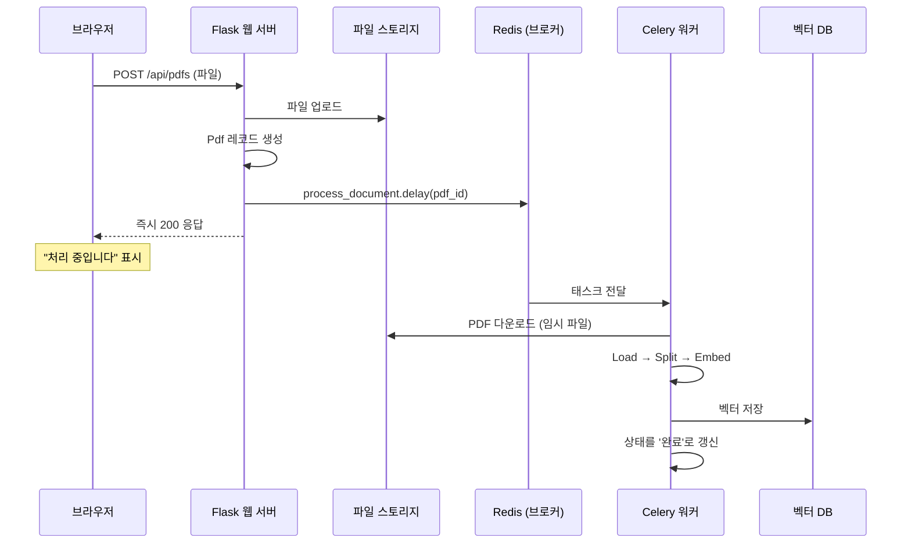

지금까지 인제스트는 "스크립트를 돌리면 끝"이었습니다.
사용자가 웹에서 PDF를 올리는 순간 이야기가 완전히 달라집니다.

## 1. 동기 처리는 왜 반드시 실패하는가

가장 순진한 구현은 이렇습니다.

```python
@bp.route("/", methods=["POST"])
def upload_file():
    file = request.files["file"]
    file.save(path)
    create_embeddings_for_pdf(pdf_id, path)   # ← 여기서 수십 초~수 분
    return {"ok": True}
```

이 코드는 개발 중에는 잘 돌아가고, **실제 문서를 올리는 순간 무너집니다.**

- 300페이지 PDF면 청크가 수천 개, 임베딩 API 호출이 수십 번입니다. 수 분이 걸립니다.
- 그 사이 브라우저·로드밸런서·프록시가 차례로 **타임아웃**을 냅니다(보통 30~60초).
- 워커 프로세스 하나가 그동안 묶여 있어, 동시에 두세 명만 올려도 서버가 멎습니다.
- 도중에 실패하면 사용자에게는 그냥 500이 뜨고, 벡터 DB에는 **절반만 들어간 상태**가 남습니다.

> **RAG 앱에서 인제스트를 백그라운드로 빼는 것은 선택이 아니라 필수입니다.**

## 2. 구조: 요청은 즉시 응답하고, 일은 큐로 넘긴다



핵심은 **HTTP 요청과 무거운 작업을 분리**하는 것입니다.
웹 서버는 "접수했습니다"만 하고 즉시 응답하고, 실제 작업은 별도 프로세스가 처리합니다.

등장인물은 셋입니다.

| 구성 요소 | 역할 |
|-----------|------|
| **웹 서버** (Flask) | 파일 받기, DB 레코드 생성, 큐에 작업 넣기 |
| **브로커** (Redis) | 작업 목록을 담아 두는 곳 |
| **워커** (Celery) | 큐에서 작업을 꺼내 실제로 처리 |

## 3. 업로드 뷰 읽기

`app/web/views/pdf_views.py`:

```python
@bp.route("/", methods=["POST"])
@login_required
@handle_file_upload
def upload_file(file_id, file_path, file_name):
    res, status_code = files.upload(file_path)
    if status_code >= 400:
        return res, status_code

    pdf = Pdf.create(id=file_id, name=file_name, user_id=g.user.id)

    # 요청 스레드에서 처리하지 않고 큐로 위임한다
    process_document.delay(pdf.id)

    return pdf.as_dict()
```

`.delay(...)`가 이 편의 주인공입니다. 함수를 **호출하지 않고**, "이 함수를 이 인자로 실행하라"는
메시지를 Redis에 넣고 즉시 반환합니다.

`@handle_file_upload` 데코레이터는 파일을 임시 디렉터리에 저장하고 UUID를 붙여 줍니다(`app/web/hooks.py`).

```python
def handle_file_upload(fn):
    @functools.wraps(fn)
    def wrapped(*args, **kwargs):
        file = request.files["file"]
        file_id = str(uuid.uuid4())

        with tempfile.TemporaryDirectory() as temp_dir:
            file_path = os.path.join(temp_dir, file_id)
            file.save(file_path)
            kwargs["file_id"] = file_id
            kwargs["file_path"] = file_path
            kwargs["file_name"] = file.filename
            return fn(*args, **kwargs)
    return wrapped
```

두 가지가 잘 되어 있습니다.

- **`tempfile.TemporaryDirectory()`를 `with`로 감싸** 뷰가 끝나면 임시 파일이 반드시 정리됩니다.
- **파일명을 UUID로 대체**합니다. 사용자가 올린 이름을 그대로 경로에 쓰면
  `../../etc/passwd` 같은 경로 조작 공격에 노출됩니다. 원본 이름은 DB 컬럼에만 보관합니다.

> 여기에 추가하면 좋은 검증들이 있습니다.
> **크기 제한**(Flask의 `MAX_CONTENT_LENGTH`), **확장자·MIME 확인**,
> 그리고 실제 파일 시그니처(`%PDF-`) 확인입니다.
> PDF는 스크립트를 품을 수 있는 복잡한 형식이라, 사용자 업로드를 받는다면
> 파일을 **웹 서버와 분리된 스토리지**에 두고, 다운로드 시 원본 도메인에서 직접 서빙하지 않는 편이 안전합니다.

## 4. 워커가 하는 일

`app/web/tasks/embeddings.py` — 태스크 전체가 이게 다입니다.

```python
@shared_task()
def process_document(pdf_id: int):
    pdf = Pdf.find_by(id=pdf_id)
    with download(pdf.id) as pdf_path:
        create_embeddings_for_pdf(pdf.id, pdf_path)
```

**태스크 인자로 `pdf_id`만 넘기는 것**을 눈여겨보세요. 파일 내용이나 객체를 넘기지 않습니다.
큐에 들어가는 메시지는 JSON으로 직렬화되므로, **작고 단순한 식별자만** 넣고
필요한 데이터는 워커가 직접 조회하는 것이 원칙입니다.

`download`는 컨텍스트 매니저입니다(`app/web/files.py`).

```python
class _Download:
    def __enter__(self):
        return self.download()      # 임시 디렉터리에 내려받고 경로 반환

    def __exit__(self, exc, value, tb):
        self.cleanup()              # 성공하든 실패하든 임시 파일 정리
        return False
```

`__exit__`이 `False`를 반환하는 것은 "예외를 삼키지 않고 그대로 올려보낸다"는 뜻입니다.
정리는 하되 실패를 숨기지 않는, 올바른 구현입니다.

### Flask와 Celery 연결하기

워커는 Flask 요청 밖에서 도는 별도 프로세스라, 그냥은 DB 세션이나 설정에 접근할 수 없습니다.
`app/celery/__init__.py`가 다리를 놓습니다.

```python
def celery_init_app(app: Flask) -> Celery:
    class FlaskTask(Task):
        def __call__(self, *args, **kwargs):
            with app.app_context():          # 모든 태스크를 앱 컨텍스트로 감싼다
                return self.run(*args, **kwargs)

    celery_app = Celery(app.name, task_cls=FlaskTask)
    celery_app.config_from_object(app.config["CELERY"])
    celery_app.set_default()
    app.extensions["celery"] = celery_app
    return celery_app
```

모든 태스크가 자동으로 `app.app_context()` 안에서 실행되므로,
태스크 코드에서 `Pdf.find_by(...)` 같은 DB 접근이 그냥 됩니다.
7편의 `app_context.push()`와 같은 문제를, 이번에는 프로세스 단위로 푸는 것입니다.

### 실행

```bash
redis-server                    # 브로커
inv dev                         # 웹 서버 (flask run)
inv devworker                   # Celery 워커
```

**셋 다 떠 있어야** 업로드가 처리됩니다.
"업로드는 성공했는데 질문하면 아무것도 못 찾는다"의 1순위 원인이 **워커가 안 떠 있는 것**입니다.

## 5. `pdf-app`에 빠져 있는 것: 진행 상태

현재 구조에는 큰 구멍이 하나 있습니다. **사용자가 인제스트 상태를 알 수 없습니다.**

- 업로드 직후 질문하면 벡터가 아직 없어 "못 찾겠다"는 답이 나옵니다. 사용자는 앱이 고장 났다고 생각합니다.
- 임베딩이 실패해도 아무도 모릅니다. 태스크가 조용히 죽고, 로그를 보는 사람만 압니다.

해결은 어렵지 않습니다. **상태 컬럼 하나**면 됩니다.

```python
class Pdf(BaseModel):
    ...
    status: str = db.Column(db.String, default="pending")
    # pending → processing → ready / failed
    error: str = db.Column(db.String, nullable=True)
    chunk_count: int = db.Column(db.Integer, nullable=True)
```

```python
@shared_task(bind=True, max_retries=3)
def process_document(self, pdf_id: str):
    pdf = Pdf.find_by(id=pdf_id)
    pdf.update(status="processing")
    try:
        with download(pdf.id) as pdf_path:
            count = create_embeddings_for_pdf(pdf.id, pdf_path)
        pdf.update(status="ready", chunk_count=count, error=None)
    except Exception as exc:
        pdf.update(status="failed", error=str(exc)[:500])
        # 일시적 오류(rate limit, 네트워크)는 지수 백오프로 재시도
        raise self.retry(exc=exc, countdown=2 ** self.request.retries)
```

프론트에서는 상태를 폴링해서 진행 표시를 보여 주고,
`ready`가 되기 전에는 채팅 입력을 막습니다.

```ts
const poll = setInterval(async () => {
  const { data } = await api.get(`/pdfs/${id}`);
  if (data.pdf.status === 'ready' || data.pdf.status === 'failed') {
    clearInterval(poll);
  }
  updateStatus(data.pdf.status);
}, 2000);
```

> **"실패를 사용자에게 보여 주는 것"이 RAG 앱에서 특히 중요합니다.**
> 일반 CRUD는 실패하면 에러가 뜨지만, RAG는 실패해도 **답변이 나옵니다.**
> 다만 근거가 없어서 부실한 답이 나올 뿐이죠. 조용한 실패가 가장 위험합니다.

## 6. 재시도와 멱등성

재시도를 켜면 **같은 태스크가 두 번 이상 실행될 수 있습니다.**
그러면 3편에서 본 중복 인제스트 문제가 그대로 생깁니다. 두 가지로 대비합니다.

- **결정적 청크 ID**(3편)를 써서 다시 넣어도 덮어쓰기가 되게 한다.
- 재시도 전에 **해당 `pdf_id`의 기존 벡터를 지우고** 시작한다.

```python
def create_embeddings_for_pdf(pdf_id: str, pdf_path: str) -> int:
    index.delete(filter={"pdf_id": pdf_id})     # 이전 시도의 잔재 제거
    ...
    return len(chunks)
```

> **멱등성(idempotency)**: 같은 작업을 몇 번 실행해도 결과가 같은 성질입니다.
> 분산 작업 큐에서는 "정확히 한 번" 실행을 보장하기 어렵기 때문에,
> **여러 번 실행돼도 괜찮게 만드는 것**이 현실적인 해법입니다.

또 하나. 임베딩 API의 요청 수 제한(rate limit)에 걸리는 일이 잦으므로,
워커 동시성을 무작정 올리지 말고 배치 크기와 함께 조절하세요.

## 7. Celery가 부담스럽다면

Celery는 기능이 많은 만큼 설정도 많습니다. 더 가벼운 선택지도 있습니다.

| 도구 | 특징 |
|------|------|
| **RQ** | Redis 기반. Celery보다 훨씬 단순. 소규모에 충분 |
| **ARQ** | asyncio 기반. FastAPI와 잘 맞음 |
| **FastAPI `BackgroundTasks`** | 같은 프로세스에서 실행. **서버가 죽으면 작업도 사라짐** |
| **Cloud Tasks / SQS + Lambda** | 서버리스. 인프라 관리 최소 |

`BackgroundTasks`는 가장 간단하지만, 재시작·배포 때 작업이 유실됩니다.
프로토타입에는 괜찮고, **운영에는 브로커가 있는 큐**를 쓰세요.

## 8. 정리

- 인제스트는 HTTP 요청 안에서 처리하면 반드시 타임아웃 난다. **큐로 넘긴다.**
- 태스크 인자는 **식별자만**. 데이터는 워커가 조회한다.
- 임시 파일은 컨텍스트 매니저로 반드시 정리한다. 업로드 파일명은 UUID로 대체한다.
- **상태 컬럼과 진행 표시는 기능의 일부다.** 조용한 실패가 가장 위험하다.
- 재시도를 켠다면 멱등성을 확보한다. 결정적 ID 또는 기존 벡터 삭제 후 재삽입.

## 실습

1. 워커를 끄고 PDF를 올린 뒤 질문해 보세요. 사용자 입장에서 무슨 일이 벌어지나요?
2. `Pdf` 모델에 `status`를 추가하고, 업로드 후 상태가 바뀌는 것을 API로 확인해 보세요.
3. 태스크 안에서 일부러 예외를 던져 재시도가 어떻게 동작하는지 워커 로그로 확인해 보세요.

다음 편은 **평가**입니다. 지금까지 나온 수많은 선택지(청크 크기, k, 모델, 메모리) 중
무엇이 좋은지 감이 아니라 숫자로 정하는 방법을 다룹니다.
