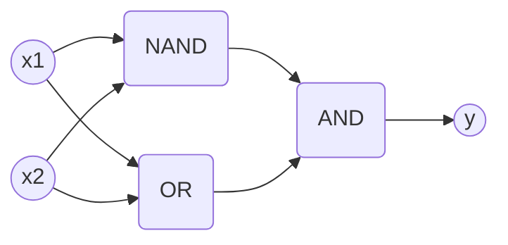

# 밑바닥부터 시작하는 딥러닝: 딥러닝의 근본 원리 이해

## 🚀 개요
이 포스트에서는 **밑바닥부터 시작하는 딥러닝** 프로젝트의 핵심 내용을 다룹니다. PyTorch나 TensorFlow 같은 고수준 프레임워크의 도움 없이, Python과 NumPy만을 활용하여 딥러닝의 엔진이 어떻게 돌아가는지 직접 구현하며 배운 점을 정리했습니다.

## 💡 구현 배경 및 동기
- **원리 파악:** 블랙박스처럼 느껴지는 딥러닝 모델의 내부 연산 과정을 명확히 이해하고자 함.
- **수학적 기초:** 선형 대수(행렬 연산)와 미분이 실제 코드에서 어떻게 최적화에 사용되는지 실습.
- **순수 구현의 가치:** 라이브러리가 제공하는 추상화 너머의 저수준 로직을 직접 다루며 문제 해결 능력을 키움.

## 🛠 핵심 코드 분석

### 1. 퍼셉트론과 논리 회로
가장 기초적인 신경망 단위인 퍼셉트론을 통해 AND, OR 게이트를 구현했습니다.

```python
import numpy as np

def AND(x1, x2):
    x = np.array([x1, x2])
    w = np.array([0.5, 0.5]) # 가중치
    b = -0.7                 # 편향
    tmp = np.sum(w*x) + b
    return 1 if tmp > 0 else 0
```
- **코드 설명:** `w`(가중치)는 각 입력 신호의 중요도를, `b`(편향)는 뉴런이 얼마나 쉽게 활성화되는지를 결정합니다. 이들의 조절만으로 단순한 논리 판단이 가능해집니다.

### 2. 활성화 함수의 마법
단순한 선형 연산에 '비선형성'을 부여하여 복잡한 문제를 풀 수 있게 해주는 활성화 함수입니다.

```python
def relu(x):
    return np.maximum(0, x)
```
- **코드 설명:** 현대 딥러닝에서 가장 널리 쓰이는 **ReLU** 함수입니다. 0 이하의 값은 차단하고 0 이상의 값은 그대로 통과시킴으로써 신경망이 더 깊게 쌓일 수 있도록 돕습니다.

## 📐 아키텍처: 다층 퍼셉트론 (MLP)
단층 퍼셉트론의 한계인 XOR 문제를 해결하기 위해 층을 쌓는 구조입니다.



## 📝 배운 점 및 결론
- **추상화의 위력:** NumPy의 행렬 곱(`np.dot`)을 사용하면 수천 개의 뉴런 연산도 단 한 줄의 코드로 표현할 수 있다는 점이 인상적이었습니다.
- **기울기의 의미:** 손실 함수의 기울기를 따라 가중치를 조금씩 업데이트하는 과정이 곧 '학습'의 본질임을 깨달았습니다.
- **향후 계획:** 다음 단계로 오차역전파(Backpropagation)를 더 효율적으로 구현하기 위한 계산 그래프 방식을 적용해 볼 예정입니다.

---

*작성자: kim-hyunjin*
*작성일: 2026-04-21*
