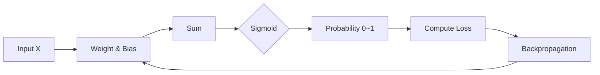

# 딥러닝의 기초: 선형 회귀와 로지스틱 회귀 모델

## 🚀 개요
딥러닝의 복잡한 신경망 구조도 결국은 **회귀(Regression)**와 **분류(Classification)**라는 두 가지 기초 위에 쌓여 있습니다. 이 포스트에서는 수치를 예측하는 '선형 회귀'와 참/거짓을 판단하는 '로지스틱 회귀'의 핵심 메커니즘을 정리합니다.

## 💡 선형 회귀 (Linear Regression): 수치 예측하기
독립 변수 $x$를 사용하여 종속 변수 $y$의 값을 예측하는 가장 단순한 모델입니다.
- **수식:** $y = ax + b$ (a: 기울기, b: 절편)
- **목표:** 실제 값과 예측값 사이의 오차(Mean Squared Error)를 최소화하는 $a$와 $b$를 찾는 것입니다.

## 🎯 로지스틱 회귀 (Logistic Regression): 참/거짓 판단하기
직선인 선형 회귀의 결과를 0과 1 사이의 값으로 변환하여 **분류**에 적합하게 만든 모델입니다.

### 시그모이드 함수 (Sigmoid Function)
아무리 큰 값이나 작은 값이 들어와도 출력 결과는 항상 0에서 1 사이로 수렴하게 만드는 함수입니다.
- **수식:** $f(x) = \frac{1}{1 + e^{-x}}$
- **의미:** 출력이 0.5 이상이면 참(1), 0.5 미만이면 거짓(0)으로 판단하는 기준이 됩니다.

### 실습 코드 (TensorFlow/Keras)
```python
import numpy as np
from tensorflow.keras.models import Sequential
from tensorflow.keras.layers import Dense

# 데이터: [공부 시간], 결과: [합격(1)/불합격(0)]
x = np.array([2, 4, 6, 8, 10, 12, 14])
y = np.array([0, 0, 0, 1, 1, 1, 1])

model = Sequential()
model.add(Dense(1, input_dim=1, activation='sigmoid')) # 시그모이드 사용

model.compile(optimizer='adam', loss='binary_crossentropy') # 이진 크로스 엔트로피
model.fit(x, y, epochs=5000)
```

## 🛠 오차 계산법의 차이
| 구분 | 선형 회귀 | 로지스틱 회귀 |
| :--- | :--- | :--- |
| **목적** | 연속적인 값 예측 | 이진 분류 (0 또는 1) |
| **오차 함수** | 평균 제곱 오차 (MSE) | 교차 엔트로피 (Binary Crossentropy) |
| **활성화 함수** | 없음 (또는 Linear) | 시그모이드 (Sigmoid) |

## 📐 학습 아키텍처


## 📝 배운 점 및 결론
- **직선에서 곡선으로:** 단순한 직선의 방정식을 시그모이드 함수에 통과시키는 것만으로도 강력한 분류 도구가 된다는 점이 흥미롭습니다.
- **딥러닝의 최소 단위:** 단일 뉴런으로 구성된 로지스틱 회귀 모델이 곧 인공 신경망을 이루는 가장 작은 단위인 '퍼셉트론'의 기초가 됨을 이해했습니다.
- **확률적 판단:** 단순한 0/1이 아니라 0.85와 같은 '확률'을 얻음으로써 판단의 신뢰도를 함께 평가할 수 있다는 장점이 있습니다.

---

*작성자: kim-hyunjin*
*작성일: 2026-04-21*
